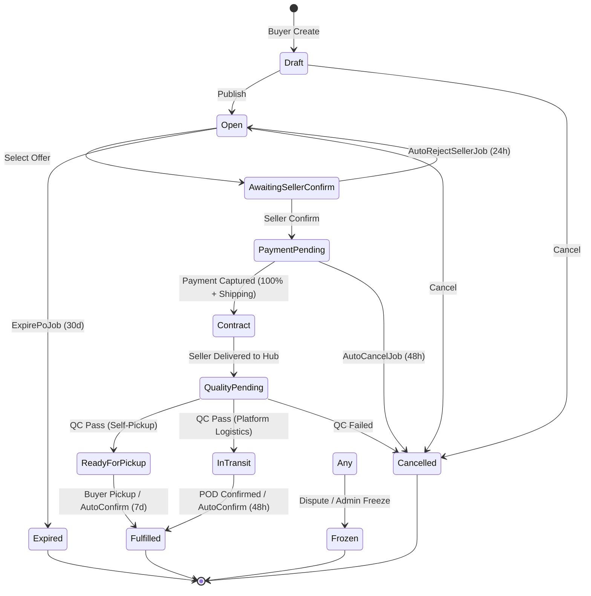
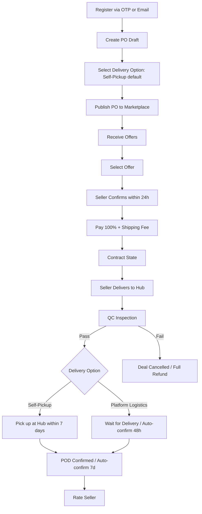
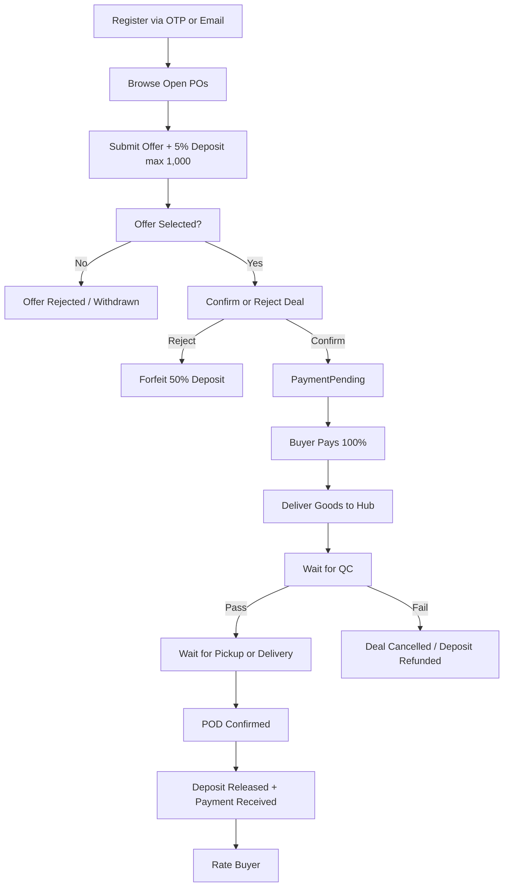

# PRD MVP Addendum — AgriForward

> **เอกสารเสริมนี้อธิบายการเปลี่ยนแปลงทั้งหมดจาก PRD v2.0 สู่ MVP Scope ที่ตกลงกันในวันที่ 2026-06-01**
> > เอกสารหลัก (`PRD.md`) ยังคงเป็น baseline แต่มีส่วนที่ไม่สอดคล้องกับ MVP scope แล้ว ให้อ้างอิงเอกสารนี้เป็นหลักสำหรับการพัฒนา MVP

---

## สารบัญการเปลี่ยนแปลง

0. [Tech Stack](#0-tech-stack)
1. [Business Model Pivot](#1-business-model-pivot)
2. [Payment & Escrow](#2-payment--escrow)
3. [Seller Deposit](#3-seller-deposit)
4. [Product Catalog](#4-product-catalog)
5. [Notifications](#5-notifications)
6. [Communication](#6-communication)
7. [Rating & Reputation](#7-rating--reputation)
8. [Dispute Resolution](#8-dispute-resolution)
9. [Tax & Invoicing](#9-tax--invoicing)
10. [Logistics & Delivery](#10-logistics--delivery)
11. [State Machine Changes](#11-state-machine-changes)
12. [User Journey Updates](#12-user-journey-updates)
13. [Entity Model Changes](#13-entity-model-changes)
14. [API Changes](#14-api-changes)
15. [Post-MVP Features](#15-post-mvp-features)

---

## 0. Tech Stack

### จาก: Blazor WASM + .NET (PRD v2.0)

| ชั้น | เทคโนโลยี |
|------|----------|
| Frontend | Blazor WASM + MudBlazor |
| Backend | ASP.NET Core Minimal APIs |
| Database | PostgreSQL + EF Core |
| Cache/Queue | Redis |
| Background Jobs | Hangfire |
| Real-time | SignalR + Redis |
| Hosting | Azure / Self-hosted |
| Language | C# |

### เป็น: Next.js + Supabase (MVP)

| ชั้น | เทคโนโลยี |
|------|----------|
| Frontend | **Next.js 14 (App Router) + Tailwind + shadcn/ui** |
| Backend | **Next.js API Routes + tRPC** |
| Database | **PostgreSQL + Prisma ORM** |
| Auth | **Supabase Auth** (OTP ให้เลย) |
| Storage | **Supabase Storage** |
| Background Jobs | **Inngest** |
| Hosting | **Vercel + Supabase** |
| Language | **TypeScript** |

### เหตุผลหลัก
- **PWA ได้ทันที** — ชาวไร่เข้าผ่านมือถือได้เหมือนแอป
- **ลด infrastructure** — ไม่ต้องมี Redis, Hangfire, SignalR
- **Auth สำเร็จรูป** — Supabase มี OTP + Email ให้เลย
- **File Upload สำเร็จรูป** — Supabase Storage สำหรับรูป dispute
- **ค่าใช้จ่ายต่ำ** — Vercel Hobby + Supabase Free tier เอาอยู่
- **Developer หาง่าย** — TypeScript หาง่ายกว่า C# ในไทย
- **Deploy เร็ว** — Vercel deploy อัตโนมัติจาก Git push

### ADR ที่เกี่ยวข้อง: [ADR-0003](adr/0003-nextjs-supabase-tech-stack.md)

---

## 1. Business Model Pivot

### จาก: Marketplace แบบดั้งเดิม
- Seller จัดการขนส่งเอง
- แพลตฟอร์มได้รายได้จาก commission (ในอนาคต)

### เป็น: Platform + Logistics + QC
- แพลตฟอร์มควบคุมขนส่งและตรวจคุณภาพ
- รายได้จาก **ค่าขนส่ง** (logistics fee) ไม่ใช่ commission
- แพลตฟอร์มเปิดกว้างและฟรี — จ่ายเฉพาะถ้าใช้บริการส่ง

### ผลกระทบ
| ส่วน | PRD v2.0 | MVP |
|------|----------|-----|
| รายได้ | Commission จากดีล | ค่าขนส่ง (Logistics) |
| ขนส่ง | Seller จัดการ | แพลตฟอร์มจัดการ |
| QC | ไม่มี | มีที่ Hub |
| มูลค่าเพิ่ม | Matching | Matching + Trust + Logistics |

---

## 2. Payment & Escrow

### การเปลี่ยนแปลงหลัก

| หัวข้อ | PRD v2.0 | MVP |
|--------|----------|-----|
| **Payment Model** | Escrow + Credit Line + Installment (3 งวด) | **Escrow + เงินสด 100% เท่านั้น** |
| **Buyer จ่าย** | แบ่งงวดหรือใช้เครดิต | **จ่ายเต็มจำนวนก่อนรับของ** |
| **Credit Line** | มี (manual underwriting โดย Ops) | **ไม่มี** |
| **Installment** | 3 งวด (มัดจำ/สัญญา/POD) | **ไม่มี** |
| **Omise** | ระบุเป็นผู้ให้บริการหลัก | **Payment Gateway ยังไม่คัดเลือก** (Omise เป็น candidate) |
| **Wallet Top-up** | มี (เติมเงินเข้า Wallet) | **ยังไม่แน่ใจว่าจำเป็น** — อาจจ่ายตรงผ่าน Gateway ได้เลย |

### เหตุผล
- ระบบเครดิตเข้าข่าย nano-finance ต้องขอใบอนุญาต ธปท.
- ลดความซับซ้อนทางเทคนิค
- แพลตฟอร์มไม่ต้องใช้ทุนสำรองจ่ายให้ Seller ล่วงหน้า

### ADR ที่เกี่ยวข้อง: [ADR-0001](adr/0001-escrow-cash-no-credit.md)

---

## 3. Seller Deposit

### การเปลี่ยนแปลงหลัก

| หัวข้อ | PRD v2.0 | MVP |
|--------|----------|-----|
| **อัตรามัดจำ** | 10% ของมูลค่า Offer | **5% ของมูลค่า Offer** |
| **上限 (Cap)** | ไม่มี | **ไม่เกิน 1,000 บาท** |
| **Forfeit (ริบ)** | 50% → Buyer / 50% → Platform | **100% → Platform** |
| **เหตุผล Forfeit** | Buyer ได้ชดเชยความเสียหาย | Buyer ยังไม่จ่ายเงินตอนนั้น → ไม่ต้องชดเชย |

### ตัวอย่างการคำนวณ

| มูลค่า Offer | PRD v2.0 (10%) | MVP (5% max 1,000) |
|-------------|----------------|-------------------|
| 10,000 บาท | มัดจำ 1,000 | มัดจำ 500 |
| 50,000 บาท | มัดจำ 5,000 | มัดจำ 1,000 (cap) |
| 100,000 บาท | มัดจำ 10,000 | มัดจำ 1,000 (cap) |

### เหตุผล
- ลด barrier to entry สำหรับชาวไร่/สหกรณ์รายย่อย
- มัดจำ 10% บนดีล 100,000 บาท = 10,000 บาท อาจสูงเกินไปสำหรับชาวไร่

---

## 4. Product Catalog

### การเปลี่ยนแปลงหลัก

| หัวข้อ | PRD v2.0 | MVP |
|--------|----------|-----|
| **ระดับ Catalog** | Category → Product → Variant (3 ระดับ) | **Category → Product (2 ระดับ)** |
| **Variant/Grade** | มี (เช่น ข้าวหอมมะลิ 100% ความชื้น <14%) | **ไม่มี — ระบุใน Offer Note** |
| **ผู้จัดการ Catalog** | Admin-managed | Admin-managed (ไม่เปลี่ยน) |

### เหตุผล
- ลดความซับซ้อนในการ seed data
- เกรด/สเปคมีความหลากหลายมากในตลาดเกษตร ให้ Seller ระบุเองใน Note ดีกว่า

---

## 5. Notifications

### การเปลี่ยนแปลงหลัก

| ช่องทาง | PRD v2.0 | MVP |
|---------|----------|-----|
| **In-app** | ✅ มี | ✅ **มี** |
| **Email (SendGrid)** | ✅ มี | ✅ **มี** |
| **Line OA** | ✅ มี | ❌ **ไม่มี (Post-MVP)** |

### Event ที่ต้องแจ้งเตือน (MVP)
1. Seller ถูกเลือก (ต้องตอบสนองภายใน 24 ชม.)
2. Buyer ได้รับ Offer ใหม่บน PO
3. PO ใกล้หมดอายุ (เตือนล่วงหน้า 3 วัน)
4. Payment สำเร็จ / ล้มเหลว
5. QC ผ่าน / ไม่ผ่าน
6. สินค้าพร้อมรับ (Self-Pickup)
7. POD ยืนยัน / Auto-confirm

---

## 6. Communication

### การเปลี่ยนแปลงหลัก

| หัวข้อ | PRD v2.0 | MVP |
|--------|----------|-----|
| **Real-time Chat** | SignalR (WebSocket) | **ไม่มี** |
| **ระบบข้อความ** | Chat Room แบบ real-time | **Comment Thread (ไม่ real-time)** |
| **Audit Trail** | มี (บันทึกทุกข้อความ) | มี (บันทึกทุก comment) |
| **การติดต่อด่วน** | ผ่านแชทในแอป | **นอกระบบ (โทรศัพท์/Line ส่วนตัว)** |

### เหตุผล
- SignalR เพิ่มความซับซ้อนทางเทคนิคมาก (connections, reconnection, scaling)
- เกษตรกรหลายคนชอบคุยโทรศัพท์มากกว่าพิมพ์
- Comment Thread มี audit trail เพียงพอสำหรับ MVP

---

## 7. Rating & Reputation

### การเปลี่ยนแปลงหลัก

| หัวข้อ | PRD v2.0 | MVP |
|--------|----------|-----|
| **ระบบให้คะแนน** | 5 ดาว + คอมเมนต์ยาว + verify review | **5 ดาว + คอมเมนต์สั้น (optional)** |
| **ML / Verify** | มี | **ไม่มี** |
| **Rating ได้เมื่อไหร่** | หลังดีลสำเร็จ (Fulfilled) | หลังดีลสำเร็จ (ไม่เปลี่ยน) |
| **Mutual Rating** | มี | มี (ไม่เปลี่ยน) |

---

## 8. Dispute Resolution

### การเปลี่ยนแปลงหลัก

| หัวข้อ | PRD v2.0 | MVP |
|--------|----------|-----|
| **ผู้ยกข้อพิพาท** | Buyer หรือ Seller | **ทั้ง Buyer และ Seller** |
| **ผลต่อ PO** | Admin ตัดสิน | **PO → Frozen ทันที** |
| **เงิน Escrow** | แช่ไว้รอ admin | แช่ไว้รอ admin (ไม่เปลี่ยน) |
| **หลักฐาน** | ไม่ระบุชัด | **Comment Thread + รูปภาพที่อัปโหลด** |
| **Admin UI** | ไม่มี | **ไม่มี (จัดการผ่าน API)** |
| **ผลตัดสิน** | Manual | Manual — คืน Buyer / โอน Seller / แบ่ง |

---

## 9. Tax & Invoicing

### การเปลี่ยนแปลงหลัก

| หัวข้อ | PRD v2.0 | MVP |
|--------|----------|-----|
| **VAT 7%** | ออกใบกำกับภาษีอัตโนมัติ | **ไม่มีระบบออกใบกำกับภาษีอัตโนมัติ** |
| **Commission** | เก็บค่าธรรมเนียมจากดีล | **ไม่เก็บ commission** |
| **ใบกำกับภาษี** | แพลตฟอร์มออกให้ | **Buyer ติดต่อ Seller นอกระบบเอง** |
| **รายได้แพลตฟอร์ม** | Commission + อื่น | **ค่าขนส่ง (Logistics)** |

### เหตุผล
- Focus ให้เกิดดีลก่อน ค่อย monetize ทีหลัง
- ไม่ต้องสร้างระบบ VAT ซับซ้อนใน MVP

---

## 10. Logistics & Delivery

### การเปลี่ยนแปลงที่ใหญ่ที่สุด

#### 10.1 แนวคิด: "แพลตฟอร์มเปิดกว้างและฟรี"

| บริการ | ค่าใช้จ่าย | สถานะ |
|--------|-----------|-------|
| โพสต์ PO | ฟรี | หลัก |
| เสนอราคา | ฟรี (มัดจำ 5%) | หลัก |
| ตรวจ QC ที่ Hub | ฟรี | หลัก |
| รับสินค้าที่ Hub (Self-Pickup) | **ฟรี** ✅ | **DEFAULT** |
| ส่งถึงบ้าน (Platform Logistics) | **เสียเงิน** 💰 | **อ็อฟชั่น** |

#### 10.2 กระบวนการใหม่

```
Seller ส่งมอบที่ Hub
    ↓
แพลตฟอร์มตรวจ QC
    ↓ ผ่าน
    ├─ [Self-Pickup] → Buyer มารับที่ Hub (ฟรี)
    └─ [Platform Logistics] → แพลตฟอร์มส่งถึง Buyer (มีค่าบริการ)
    ↓ ไม่ผ่าน
    → ดีลยกเลิก → คืนเงิน Buyer ทั้งหมด
```

#### 10.3 ค่าขนส่ง

| หัวข้อ | รายละเอียด |
|--------|-----------|
| **ผู้จ่าย** | Buyer |
| **การคิด** | แยกบิลจากราคาสินค้า (ไม่รวมใน Offer) |
| **เวลาจ่าย** | รวมกับเงินสินค้า 100% ตอน PaymentPending |
| **รายได้** | แพลตฟอร์มเก็บทั้งหมด |
| **คิดยังไง** | Flat rate หรือ ตามระยะทาง/น้ำหนัก (TBD by Ops) |

#### 10.4 Buyer เลือกตอนไหน?

**ตอนสร้าง PO** — Buyer เลือก delivery option ตั้งแต่แรก
- Self-Pickup (default)
- Platform Logistics (จ่ายเพิ่ม)

**เปลี่ยนได้ไหม?**
- Self-Pickup → Logistics: ได้ ถ้าสินค้ายังไม่ถึง Hub (จ่าย logistics fee เพิ่ม)
- Logistics → Self-Pickup: ไม่ได้ (logistics fee อาจถูก commit แล้ว)

---

## 11. State Machine Changes

### 11.1 PO State Machine — แบบเต็ม (MVP)



### 11.2 States ที่เพิ่ม/เปลี่ยน

| State | สถานะ | อธิบาย |
|-------|--------|--------|
| **QualityPending** ⭐ | เพิ่มใหม่ | รอตรวจ QC ที่ Hub |
| **ReadyForPickup** ⭐ | เพิ่มใหม่ | QC ผ่าน รอ Buyer มารับ |
| **InTransit** ⭐ | เพิ่มใหม่ | QC ผ่าน แพลตฟอร์มส่งของ |
| **CaptureInProgress** ❌ | ตัดออก | เป็น technical concern ไม่ใช่ business state |
| **Contract** 🔄 | เปลี่ยนความหมาย | = เงินเข้า escrow รอ Seller ส่งที่ Hub |
| **Fulfilled** 🔄 | เปลี่ยนความหมาย | = ดีลสำเร็จ + ค่าขนส่งเป็นรายได้แพลตฟอร์ม |

### 11.3 Hangfire Jobs

| Job | Trigger | ผล | ใหม่/เก่า |
|-----|---------|-----|-----------|
| ExpirePoJob | 30 วันหลัง Publish | Open → Expired | เก่า |
| AutoRejectSellerJob | 24 ชม. หลัง AwaitingSellerConfirm | AwaitingSellerConfirm → Open (forfeit) | เก่า |
| **AutoCancelJob** ⭐ | 48 ชม. หลัง PaymentPending | PaymentPending → Cancelled | **ใหม่** |
| AutoConfirmPodJob | 48 ชม. หลัง InTransit | InTransit → Fulfilled | เก่า (แต่ trigger เปลี่ยน) |
| **AutoConfirmPickupJob** ⭐ | 7 วันหลัง ReadyForPickup | ReadyForPickup → Fulfilled | **ใหม่** |

---

## 12. User Journey Updates

### 12.1 Buyer Journey (MVP)



### 12.2 Seller Journey (MVP)



### 12.3 สิ่งที่เปลี่ยนใน Buyer Journey

| ขั้นตอน | PRD v2.0 | MVP |
|---------|----------|-----|
| Top-up Wallet | มี | **อาจไม่จำเป็น** |
| Select Delivery | ไม่มี (ส่งตรงเสมอ) | **เลือกตอนสร้าง PO** |
| Download Tax Invoice | มี | **ไม่มี (ติดต่อ Seller นอกระบบ)** |
| Tracking Number | Seller กรอก | **แพลตฟอร์มจัดการ (ถ้าเลือก Logistics)** |
| POD | ยืนยันที่ปลายทาง | ยืนยันที่ Hub หรือที่ปลายทาง |

### 12.4 สิ่งที่เปลี่ยนใน Seller Journey

| ขั้นตอน | PRD v2.0 | MVP |
|---------|----------|-----|
| Deposit | 10% | **5% (max 1,000)** |
| Forfeit | 50% → Buyer / 50% → Platform | **100% → Platform** |
| Tracking | Seller กรอก tracking number | **ส่งมอบที่ Hub เท่านั้น** |
| ขนส่ง | Seller จัดการ | **แพลตฟอร์มจัดการ** |

---

## 13. Entity Model Changes

### 13.1 Entities ที่เพิ่ม

| Entity | เหตุผล |
|--------|--------|
| **QualityControl** (หรือ QCEvent) | บันทึกผลการตรวจสอบคุณภาพที่ Hub |
| **DeliveryOption** | เก็บว่า Buyer เลือก Self-Pickup หรือ Logistics |
| **LogisticsFee** | บันทึกค่าขนส่งแยกจากราคาสินค้า |

### 13.2 Entities ที่เปลี่ยน

| Entity | เปลี่ยนอะไร |
|--------|-------------|
| **PurchaseOrder** | เพิ่ม `DeliveryOption`, `ShippingFee`, `HubDeliveryDate`, `QcStatus` |
| **Offer** | `DepositAmount` คำนวณใหม่ (5% max 1,000) |
| **Payment** | รวมค่าขนส่ง (`Amount = ProductPrice + ShippingFee`) |
| **ShipmentInfo** | อาจไม่จำแล้ว (แพลตฟอร์มจัดการขนส่งเอง) หรือเก็บ internal tracking |

### 13.3 Enums ที่เปลี่ยน

| Enum | เปลี่ยน |
|------|---------|
| **PoState** | เพิ่ม `QualityPending`, `ReadyForPickup`, `InTransit` / ตัด `CaptureInProgress` |
| **WalletTxType** | ตัด `ForfeitCompensation` (เพราะ forfeit 100% → platform) |

---

## 14. API Changes

### 14.1 APIs ที่เพิ่ม

| Endpoint | เหตุผล |
|----------|--------|
| `POST /api/pos/{id}/delivery-option` | เปลี่ยน Self-Pickup → Logistics (ก่อนถึง Hub) |
| `POST /api/pos/{id}/seller-delivered` | Seller ยืนยันส่งมอบที่ Hub |
| `POST /api/pos/{id}/qc-pass` | Admin/Staff ยืนยัน QC ผ่าน |
| `POST /api/pos/{id}/qc-fail` | Admin/Staff ยืนยัน QC ไม่ผ่าน |
| `POST /api/pos/{id}/buyer-pickup` | Buyer ยืนยันมารับที่ Hub |

### 14.2 APIs ที่เปลี่ยน

| Endpoint | เปลี่ยน |
|----------|---------|
| `POST /api/pos` | รับเพิ่ม `deliveryOption` (SelfPickup / PlatformLogistics) |
| `POST /api/payments/{poId}/initiate` | คำนวณรวมค่าขนส่ง |
| `POST /api/pos/{id}/tracking` | อาจเปลี่ยนเป็น internal use |

### 14.3 APIs ที่อาจตัดออก

| Endpoint | เหตุผล |
|----------|---------|
| SignalR Chat Hub | ไม่มี real-time chat |
| Line OA endpoints | ไม่มีใน MVP |
| `GET /api/pos/{id}/invoice` | ไม่มี VAT auto-invoicing |

---

## 15. Post-MVP Features

ฟีเจอร์เหล่านี้ถูกตัดออกจาก MVP แต่วางแผนไว้สำหรับ phase ถัดไป:

| ลำดับ | ฟีเจอร์ | ความสำคัญ |
|-------|---------|-----------|
| 1 | **Line OA Notifications** | สูง — ช่องทางหลักของเกษตรกรไทย |
| 2 | **Real-time Chat (SignalR)** | กลาง — เมื่อมีปริมาณดีลสูง |
| 3 | **Credit Line / Installment** | สูง — ต้องมีใบอนุญาตก่อน |
| 4 | **VAT Auto-Invoicing** | กลาง — เมื่อเริ่มเก็บ commission |
| 5 | **Admin Dashboard UI** | กลาง — ตอนนี้ใช้ API โดยตัว |
| 6 | **KYC Verification** | กลาง — มี field แล้วแต่ยังไม่ verify |
| 7 | **Multiple Hub Locations** | กลาง — เริ่มจาก Hub เดียว |
| 8 | **Appointment System (Pickup)** | ต่ำ — ใช้ walk-in ก่อน |
| 9 | **Storage Fee** | ต่ำ — ขัด philosophy "ฟรี" |
| 10 | **Product Variant (3rd level)** | ต่ำ — 2 ระดับพอสำหรับ MVP |

---

## เอกสารที่เกี่ยวข้อง

- [`CONTEXT.md`](../CONTEXT.md) — Business Rules (BR-001 ถึง BR-016)
- [`docs/adr/0001-escrow-cash-no-credit.md`](adr/0001-escrow-cash-no-credit.md) — ADR การตัดสินใจใช้เงินสด
- [`docs/adr/0003-nextjs-supabase-tech-stack.md`](adr/0003-nextjs-supabase-tech-stack.md) — ADR เลือกใช้ Next.js + Supabase แทน Blazor + .NET

---

*เอกสารนี้สร้างขึ้นหลัง grill-with-docs session วันที่ 2026-06-01*
*หากมีข้อสงสัยให้อ้างอิง `CONTEXT.md` เป็นหลัก*
