# Product Requirements Document — AgriForward

## 1. Document Control
| Attribute | Value |
|-----------|-------|
| Version | **2.1-MVP** |
| Status | **Active — MVP Scoped** |
| Date | **2026-06-01** |
| Owner | Product Team |

> **⚠️ หมายเหตุสำคัญ:** PRD ฉบับนี้เป็น baseline (v2.0) แต่มีการปรับ scope สำหรับ MVP ตามผลจาก grill-with-docs session (2026-06-01) รายละเอียดการเปลี่ยนแปลงทั้งหมดอยู่ใน `PRD-MVP-ADDENDUM.md`

---

## 2. Executive Summary

AgriForward is a B2B agricultural **platform with integrated logistics and quality control**, purpose-built for Thailand, connecting farmers and agricultural cooperatives (sellers) with food processors, exporters, and wholesale traders (buyers). The platform replaces fragmented WhatsApp and phone-based procurement with a structured, trust-based digital workflow: buyers publish purchase orders, sellers commit via offers backed by a **5% deposit (capped at 1,000 THB)**, and the platform **handles pickup at Hub, quality inspection, and delivery** (with a free Self-Pickup option and paid Platform Logistics add-on). Buyer pays **100% cash upfront into escrow**; no credit or installment in MVP.

The MVP supports end-to-end deal execution—from registration, through offer selection, payment, **Hub delivery, QC inspection,** POD confirmation, and post-trade rating—with comment-based communication (no real-time chat) and email + in-app notifications only.

**Key deviations from PRD v2.0:**
- ❌ No credit system / installment (ADR-0001)
- ❌ No SignalR real-time chat → Comment Thread (BR-007)
- ❌ No Line OA notifications in MVP (BR-006)
- ❌ No VAT auto-invoicing / commission fees (BR-010)
- ❌ No Admin UI (API-only) (deferred)
- ✅ Platform-managed logistics + QC (ADR-0002)
- ✅ Self-Pickup as **free default**, Platform Logistics as **paid option** (BR-012)
- ✅ Seller deposit reduced from 10% to **5% (max 1,000 THB)** (BR-004)
- ✅ Forfeit deposit goes **100% to platform** (BR-004)
- ✅ PO State Machine includes **QualityPending, ReadyForPickup, InTransit** states

The system is built on ASP.NET Core Minimal APIs with a Blazor WASM frontend, PostgreSQL for persistence, Redis for idempotency and caching, Hangfire for background jobs.

---

---

## 3. Vision & Mission

### 3.1 Vision Statement
To become Thailand's most trusted digital agricultural marketplace by embedding financial accountability, transparent logistics, and tamper-proof audit trails into every trade.

### 3.2 Mission Statement
Empower Thai farmers and agri-businesses to trade confidently through a platform that enforces commitment via deposits, guarantees payment via escrow-like flows, and provides an immutable record of every transaction for compliance and dispute resolution.

### 3.3 Strategic Goals (3–5 measurable goals)
1. **Trust & Deposit Enforcement**: 100% of offers on the platform require a 10% deposit hold, reducing no-shows and abandoned deals.
2. **Payment Completion Rate**: Achieve >95% successful payment capture on `PaymentPending` POs via Omise card and PromptPay.
3. **Audit Integrity**: Maintain a zero-tamper audit chain with daily automated verification and sub-second hash validation.
4. **Seller-Buyer Engagement**: Enable real-time communication per PO via SignalR, with post-trade mutual ratings surfacing reputation publicly.
5. **Regulatory Compliance**: Generate VAT 7% tax invoices automatically and capture PDPA consent before any data processing.

---

## 4. Stakeholders & Actors

### 4.1 Primary Actors (Detailed personas for Buyer, Seller, Admin)

**Buyer (ผู้ซื้อ)**
- *Goals*: Find reliable suppliers, negotiate price transparently, pay securely, receive goods on time, maintain tax records.
- *Pain points*: Unreliable sellers, no-shows after verbal agreements, manual invoice tracking, fragmented communication.
- *Success criteria*: Can publish a PO, receive ≥1 valid offer, pay, confirm delivery, and download a tax invoice within 48 hours.

**Seller (ผู้ขาย)**
- *Goals*: Access bulk buyers, guarantee payment before delivery, build reputation score, minimize deal risk.
- *Pain points*: Buyers defaulting on payment, lack of price discovery, no structured contract.
- *Success criteria*: Can browse open POs, submit an offer with affordable deposit, get selected, confirm, deliver, and receive wallet credit upon POD.

**Admin (ผู้ดูแลระบบ)**
- *Goals*: Monitor platform health, resolve disputes, freeze fraudulent accounts, verify audit chain integrity.
- *Pain points*: No dedicated admin UI (MVP admin actions are API-only or direct DB).
- *Success criteria*: Can freeze a PO, run audit verification, and process refunds via existing endpoints.

### 4.2 Secondary Actors
| Actor | Role |
|-------|------|
| System (Hangfire) | Executes `ExpirePoJob`, `AutoRejectSellerJob`, `AutoConfirmPodJob`, `VerifyAuditChainJob`, `DispatchNotificationsJob` |
| Omise Payment Gateway | Processes card charges, PromptPay QR generation, webhook events (`charge.complete`, `charge.failed`) |
| SendGrid | Dispatches transactional emails (offer selected, payment confirmed, POD confirmed) |
| Line Messaging API | Dispatches push notifications to users who have linked Line OA |
| SignalR Hub | Broadcasts chat messages and typing indicators per PO room |

### 4.3 Actor Permissions Matrix
| Feature | Buyer | Seller | Admin | Anonymous |
|---------|-------|--------|-------|-----------|
| Register / Login | ✓ | ✓ | ✓ | ✓ |
| Browse Marketplace | ✓ | ✓ | ✓ | ✓ |
| Create / Manage PO | ✓ | — | — | — |
| Submit / Withdraw Offer | — | ✓ | — | — |
| Select Offer | ✓ | — | — | — |
| Confirm / Reject Deal | — | ✓ | — | — |
| Pay for PO | ✓ | — | — | — |
| Enter Shipment Tracking | — | ✓ | — | — |
| Confirm POD | ✓ | — | — | — |
| Rate Counterparty | ✓ | ✓ | — | — |
| Chat on PO | ✓ | ✓ | — | — |
| Top-up Wallet | ✓ | ✓ | — | — |
| View Notifications | ✓ | ✓ | ✓ | — |
| Freeze PO | — | — | ✓ | — |
| Audit Verification | — | — | ✓ | — |
| View Public Reputation | ✓ | ✓ | ✓ | ✓ |

---

## 5. User Journey Maps

### 5.1 Buyer Journey

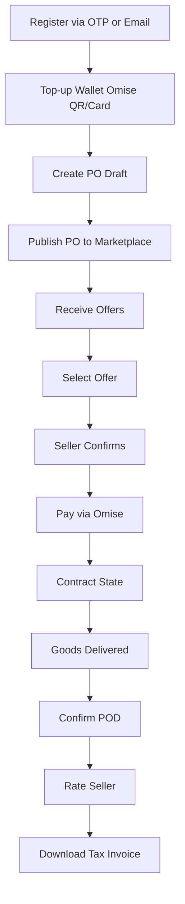

**Step-by-step narrative**
1. **Onboarding**: Buyer registers with Thai phone OTP or email/password. PDPA consent modal blocks first login until accepted.
2. **Wallet**: Buyer tops up wallet via Omise PromptPay QR or card. Wallet holds `AvailableBalance` and `HeldBalance`.
3. **Post PO**: Buyer creates a `PurchaseOrder` in `Draft`, adds product category, quantity, target price, delivery address, and deadline. Publishes to `Open`.
4. **Evaluate**: Buyer views incoming `Offer`s on `MyPos.razor` or `PoDetail.razor`. Each offer shows price, quantity, seller score, and note.
5. **Select**: Buyer selects one offer. PO moves to `AwaitingSellerConfirm`. Non-selected offers are rejected and deposits released.
6. **Wait**: Seller has 24 hours to confirm. If timeout, `AutoRejectSellerJob` fires—seller forfeits 50% deposit, PO returns to `Open`.
7. **Pay**: After seller confirms, PO moves to `PaymentPending`. Buyer pays full amount via Omise card (3D Secure) or PromptPay QR.
8. **Contract**: Webhook `charge.complete` moves PO to `Contract`. Seller enters tracking number.
9. **POD**: Buyer clicks "ยืนยันรับสินค้า" in `PoDetail.razor`. If buyer does nothing for 48 hours, `AutoConfirmPodJob` fulfills automatically.
10. **Post-sale**: Seller deposit is released. Both parties rate each other. Buyer downloads HTML tax invoice.

### 5.2 Seller Journey

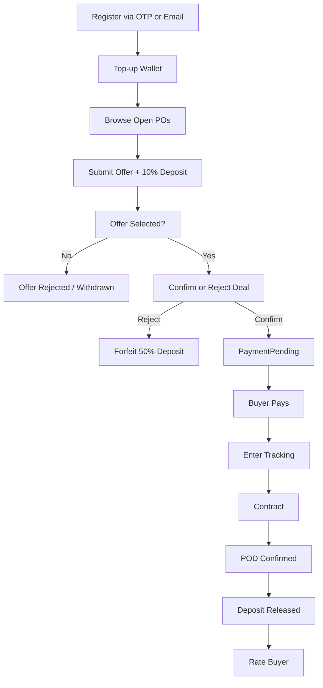

**Step-by-step narrative**
1. **Onboarding**: Same registration flow as buyer. Dual-role account—same user can be both buyer and seller.
2. **Discover**: Seller browses `Marketplace.razor` or `ProductPos.razor`, filtering by product category (ข้าว, มันสำปะหลัง, ข้าวโพด, etc.).
3. **Bid**: Seller submits `Offer` with offered price, quantity, and optional note. `DepositLedgerService.CalculateDeposit()` computes 10% of `price × qty`; amount moves from `AvailableBalance` to `HeldBalance`.
4. **Outcome**: If not selected, offer is `Rejected` and deposit `Release`d. Seller can also `Withdraw` before selection.
5. **Selection**: If selected, seller receives in-app + email + Line notification. Seller visits `PoDetail.razor` to confirm or reject within 24 hours.
6. **Confirm**: PO moves to `PaymentPending`. Buyer pays.
7. **Deliver**: After payment webhook, seller enters tracking number via `PoDetail.razor`. PO moves to `Contract`.
8. **Fulfill**: Upon POD confirmation, `Offer.Fulfill()` releases deposit to `AvailableBalance`. Seller can request wallet withdrawal (pending admin out-of-band approval).
9. **Reputation**: Seller rates buyer; public reputation profile updates.

### 5.3 Admin Journey

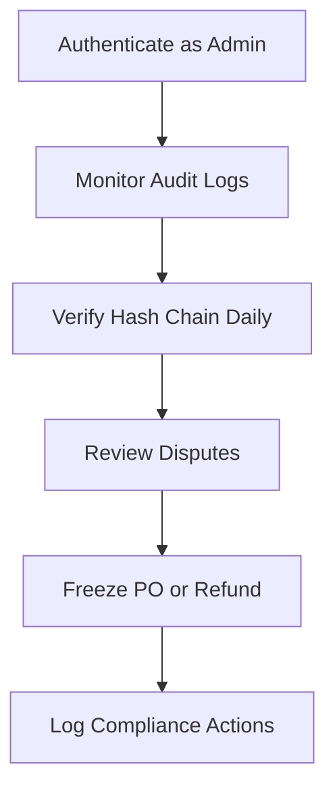

**Step-by-step narrative**
1. **Access**: Admin role is set via `POST /api/dev/make-admin/{email}` (dev) or direct DB assignment. There is no dedicated admin UI in MVP.
2. **Audit**: Admin calls `GET /api/admin/audit` to list events or `POST /api/admin/audit/verify` to run chain verification. `VerifyAuditChainJob` also runs daily.
3. **Disputes**: When a user raises a dispute (`POST /api/po/{id}/dispute`), admin is notified. Resolution is manual (API calls or DB update).
4. **Intervention**: Admin can freeze a PO (`POST /api/po/{id}/freeze`) to halt all transitions. Refunds are triggered via `POST /api/payment/{paymentId}/refund`.

---

## 6. Functional Requirements

### 6.1 Authentication & Identity

**Module description**: Handles user registration, login (email/password and Thai phone OTP), JWT token lifecycle, logout, password reset, and PDPA consent gating.

**User stories**
- As a user, I want to register with my Thai phone number via OTP, so that I can access the platform without remembering a password.
- As a user, I want to register with email and password, so that I have an alternative login method.
- As a user, I want to give PDPA consent once during first login, so that the platform is legally compliant.

**Detailed requirements**
- FR-AUTH-001: The system shall support phone OTP registration and login using a 6-digit PIN (`OtpService`).
- FR-AUTH-002: The system shall support email/password registration and login with bcrypt hashing.
- FR-AUTH-003: The system shall issue a JWT access token (short expiry) and a refresh token (long-lived, stored in `RefreshToken` table) upon successful login.
- FR-AUTH-004: The system shall provide a token refresh endpoint to rotate access tokens without re-authentication.
- FR-AUTH-005: The system shall enforce PDPA consent modal (`StorefrontLayout.razor`) before allowing navigation to any authenticated page.
- FR-AUTH-006: The system shall record `User.PdpaConsentedAt` timestamp in the database.

**Acceptance criteria**
- AC-AUTH-001: OTP PIN in development is always `000000` for testability.
- AC-AUTH-002: JWT access token expires within a configurable short window (default 15 minutes).
- AC-AUTH-003: Refresh token is invalidated on logout.
- AC-AUTH-004: Unauthenticated users attempting to access `RequireAuthorization` endpoints receive HTTP 401.

**Key business rules**
- One account per email; phone numbers must be unique.
- PDPA consent is immutable once given.

**UI references**
- `Register.razor`, `Login.razor`, `ForgotPassword.razor`, `OAuthCallback.razor`, `StorefrontLayout.razor` (PDPA modal gate)

**API references**
- `GET /api/auth/me`
- `POST /api/auth/send-otp`
- `POST /api/auth/verify-otp`
- `POST /api/auth/register`
- `POST /api/auth/login`
- `POST /api/auth/refresh`
- `POST /api/auth/logout`
- `POST /api/auth/reset-password`
- `POST /api/auth/pdpa-consent`

---

### 6.2 User Management & Profile

**Module description**: Manages user attributes, dual-role flagging, and public reputation profiles.

**User stories**
- As a user, I want to update my display name and contact details, so that counterparties can identify me.
- As a buyer, I want to view a seller's public reputation before selecting an offer, so that I can assess trustworthiness.

**Detailed requirements**
- FR-USER-001: The system shall store `DisplayName`, `Email`, `PhoneNumber`, `Role` (User/Admin), `BuyerScore`, `SellerScore`, and `KycStatus`.
- FR-USER-002: The system shall expose a public reputation endpoint returning aggregated rating scores and recent reviews.

**Acceptance criteria**
- AC-USER-001: Reputation profile includes average stars, total ratings, and the 5 most recent reviews with comment and timestamp.

**Key business rules**
- `BuyerScore` and `SellerScore` are updated after each mutual rating post-fulfillment.
- `KycStatus` exists as a field but has no verification flow in MVP.

**UI references**
- `Profile.razor`, `ReputationProfile.razor`

**API references**
- `GET /api/users/{id}/reputation`

---

### 6.3 Wallet & Financial Management

**Module description**: Each user has one `UserWallet` with `AvailableBalance` and `HeldBalance`. All movements are recorded as immutable `WalletTransaction` rows. Top-up uses Omise; withdrawals are pending admin approval.

**User stories**
- As a user, I want to top up my wallet via PromptPay QR or credit card, so that I can fund offers or payments.
- As a user, I want to see my wallet balance and full transaction history, so that I can reconcile my finances.

**Detailed requirements**
- FR-WALLET-001: The system shall maintain `AvailableBalance` and `HeldBalance` per user.
- FR-WALLET-002: The system shall support real top-up via Omise PromptPay QR and card, credited via webhook.
- FR-WALLET-003: The system shall support a dev-only top-up endpoint (`POST /api/wallet/dev-topup`) for testing.
- FR-WALLET-004: The system shall record every wallet movement as `WalletTransaction` with type (`TopUp`, `Hold`, `Release`, `Forfeit`, `ForfeitCompensation`, `Payment`, `Refund`, `Fee`).
- FR-WALLET-005: The system shall support withdrawal requests (`POST /api/wallet/withdraw`) with pending status.

**Acceptance criteria**
- AC-WALLET-001: Top-up idempotency is enforced via Redis (`IdempotencyMiddleware`) to prevent duplicate charges.
- AC-WALLET-002: Wallet is protected by optimistic concurrency (`RowVersion`).

**Key business rules**
- `DepositLedgerService.CalculateDeposit(price, qty)` is the single source of truth for deposit computation (10%, rounded to 2 decimal places).
- `HeldBalance` cannot be withdrawn; only `AvailableBalance` is spendable.

**UI references**
- `Wallet.razor`

**API references**
- `GET /api/wallet`
- `GET /api/wallet/transactions`
- `POST /api/wallet/dev-topup`
- `POST /api/wallet/topup/initiate`
- `GET /api/wallet/topup/status/{chargeId}`
- `POST /api/wallet/withdraw`

---

### 6.4 Product Catalog & Categories

**Module description**: Static product taxonomy used to classify purchase orders. Seeded in migrations.

**User stories**
- As a buyer, I want to categorize my PO by product type, so that sellers can find relevant orders.
- As a seller, I want to filter the marketplace by product category, so that I see only relevant POs.

**Detailed requirements**
- FR-CAT-001: The system shall provide 10 seeded product categories (e.g., ข้าว, มันสำปะหลัง, ข้าวโพด, อ้อย, ยางพารา, ปาล์มน้ำมัน, กาแฟ, ผัก, ผลไม้, อื่นๆ).
- FR-CAT-002: The system shall expose read-only category endpoints.

**Acceptance criteria**
- AC-CAT-001: Categories are returned in both Thai and English based on i18n context.

**UI references**
- `Marketplace.razor`, `ProductPos.razor`, `PoNew.razor`

**API references**
- `GET /api/categories`
- `GET /api/categories/{id:guid}`

---

### 6.5 Purchase Order Lifecycle

**Module description**: The central deal orchestrator. A `PurchaseOrder` progresses through 10 states governed by guard methods on the entity. Hangfire jobs automate timeouts.

**User stories**
- As a buyer, I want to create a PO draft and publish it when ready, so that I can control timing.
- As a buyer, I want to cancel my PO if no good offers arrive, so that I am not locked in.
- As a seller, I want to see clearly whether a PO is open for bidding, so that I do not waste time.

**Detailed requirements**
- FR-PO-001: The system shall allow creation of a PO in `Draft` with fields: product category, quantity, target price, delivery address, deadline.
- FR-PO-002: The system shall allow publishing a `Draft` PO to `Open`.
- FR-PO-003: The system shall allow cancelling a PO only from `Draft` or `Open`.
- FR-PO-004: The system shall auto-expire an `Open` PO 30 days after publication (`ExpirePoJob`).
- FR-PO-005: The system shall release all held offer deposits upon expiry or cancellation.
- FR-PO-006: The system shall support manual buyer POD confirmation (`PodConfirmedPo`).
- FR-PO-007: The system shall auto-confirm POD 48 hours after `Contract` (`AutoConfirmPodJob`).
- FR-PO-008: The system shall allow admin to freeze a PO (`Frozen` state), halting all transitions.

**Acceptance criteria**
- AC-PO-001: A PO in `AwaitingSellerConfirm` automatically returns to `Open` if seller does not confirm within 24 hours (`AutoRejectSellerJob`).
- AC-PO-002: PO entity uses `RowVersion` for optimistic concurrency.
- AC-PO-003: Only the PO owner (buyer) can cancel, update, or select an offer.

**Key business rules**
- `PurchaseOrder.Publish()`, `LockForOffer()`, `SellerConfirm()`, `SellerReject()`, `PaymentCaptured()`, `ShipmentBooked()`, `PodConfirmed()`, `Freeze()` are the only valid state transition paths.
- Never set `State` property directly—always use guard methods.

**State machines**
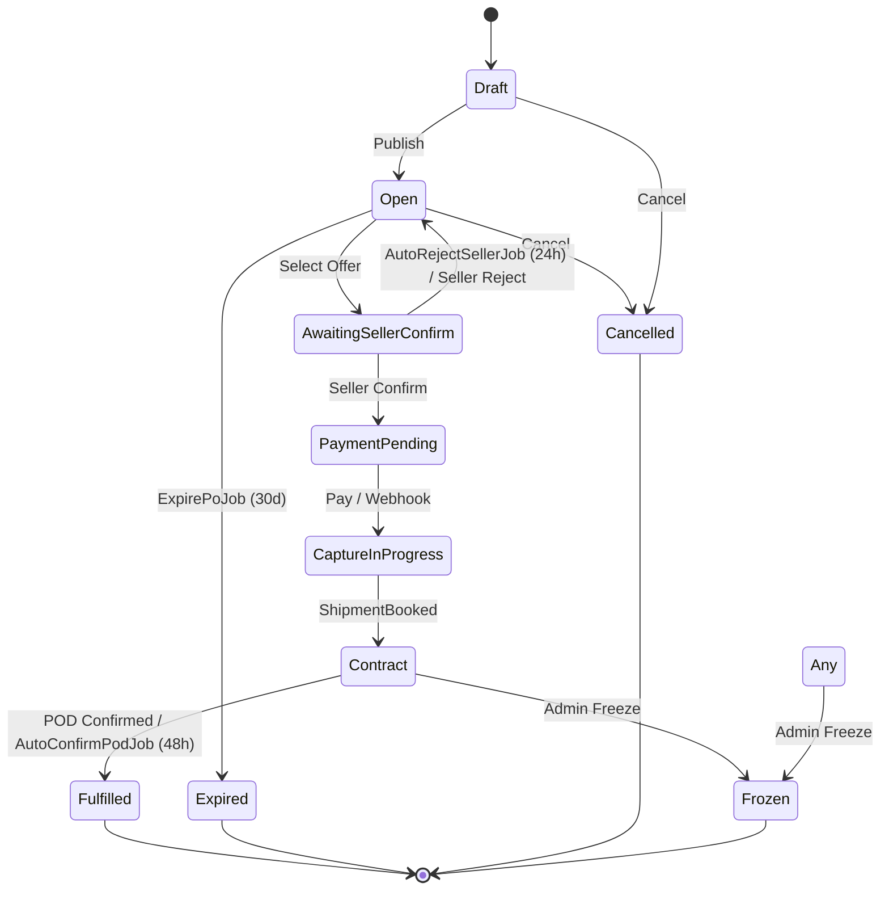

**UI references**
- `PoNew.razor`, `PoDetail.razor`, `MyPos.razor`, `Marketplace.razor`, `ProductPos.razor`

**API references**
- `GET /api/pos`
- `GET /api/pos/{id:guid}`
- `POST /api/pos`
- `PUT /api/pos/{id:guid}`
- `DELETE /api/pos/{id:guid}`
- `POST /api/pos/{id:guid}/publish`
- `PATCH /api/pos/{id:guid}/cancel`
- `POST /api/pos/{id:guid}/seller-confirm`
- `POST /api/pos/{id:guid}/seller-reject`
- `POST /api/pos/{id:guid}/expire`
- `POST /api/pos/{id:guid}/freeze`
- `POST /api/pos/{id:guid}/payment-captured`
- `POST /api/pos/{id:guid}/shipment-booked`
- `POST /api/pos/{id:guid}/pod-confirmed`
- `POST /api/pos/{id:guid}/tracking`
- `GET /api/pos/{id:guid}/tracking`
- `POST /api/offers/{offerId:guid}/select`

---

### 6.6 Offer & Deposit System

**Module description**: Sellers bid on open POs. Each offer locks a 10% deposit. Guards enforce valid transitions.

**User stories**
- As a seller, I want to submit an offer with my price and quantity, so that the buyer considers me.
- As a seller, I want to withdraw my offer before selection, so that I can reclaim my deposit if terms change.
- As a buyer, I want to select the best offer, so that the deal proceeds.

**Detailed requirements**
- FR-OFFER-001: The system shall allow offer submission only on `Open` POs.
- FR-OFFER-002: The system shall hold 10% deposit in `UserWallet.HeldBalance` upon submission.
- FR-OFFER-003: The system shall allow withdrawal only while in `Open` state.
- FR-OFFER-004: The system shall reject all non-selected offers and release their deposits when one offer is selected.
- FR-OFFER-005: The system shall forfeit 50% of deposit to buyer and 50% to platform (or burn) if seller rejects after selection or times out.

**Acceptance criteria**
- AC-OFFER-001: `Offer.Accept()`, `Reject()`, `Withdraw()`, `Fulfill()` throw `InvalidOfferTransitionException` on illegal transitions.
- AC-OFFER-002: Deposit calculation always uses `DepositLedgerService.CalculateDeposit()`.

**Key business rules**
- One seller may submit multiple offers on the same PO (buyer can choose the best).
- Deposit is released on `Reject`, `Withdraw`, or PO expiry/cancellation.
- Deposit is forfeited on seller timeout/reject after selection.

**State machines**
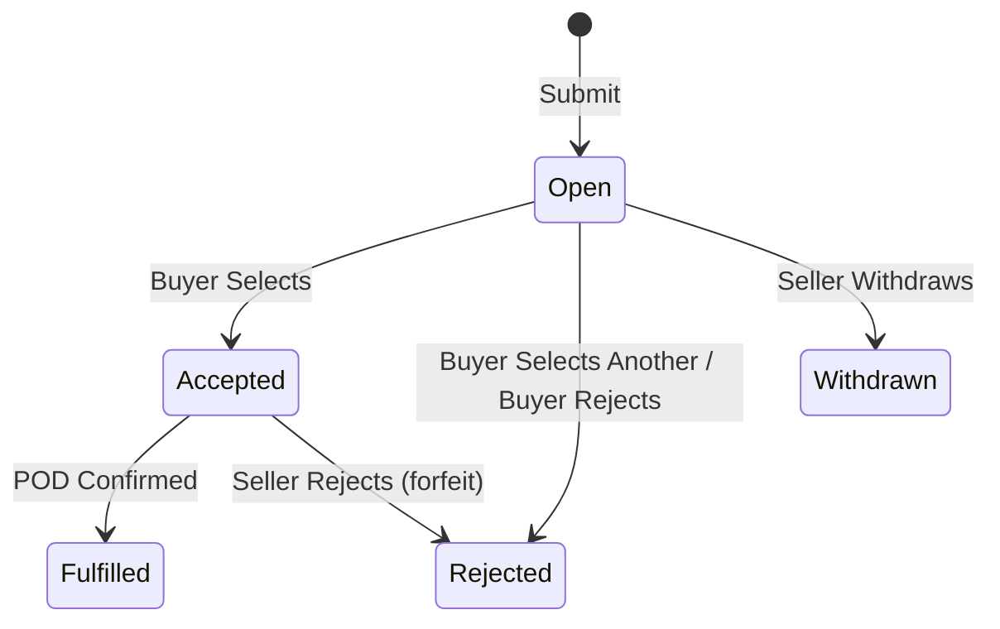

**UI references**
- `OfferNew.razor`, `MyOffers.razor`, `PoDetail.razor`

**API references**
- `GET /api/pos/{poId:guid}/offers`
- `GET /api/pos/{poId:guid}/offers/{offerId:guid}`
- `POST /api/pos/{poId:guid}/offers`
- `POST /api/pos/{poId:guid}/offers/{offerId:guid}/withdraw`
- `GET /api/offers/mine`
- `POST /api/offers/{offerId:guid}/select`

---

### 6.7 Payment Gateway Integration (Omise)

**Module description**: Buyer pays the full PO value via Omise. Supports card (3D Secure) and PromptPay QR. Webhook drives state transition to `Contract`.

**User stories**
- As a buyer, I want to pay by credit card securely, so that the seller is guaranteed payment.
- As a buyer, I want to pay by PromptPay QR, so that I can use my mobile banking app.

**Detailed requirements**
- FR-PAY-001: The system shall initiate an Omise charge (card or PromptPay) for a `PaymentPending` PO.
- FR-PAY-002: The system shall handle `charge.complete` webhook to confirm payment and move PO to `CaptureInProgress` then `Contract`.
- FR-PAY-003: The system shall prevent duplicate charges via Redis idempotency key (`IdempotencyMiddleware`).
- FR-PAY-004: The system shall support manual admin refund via `POST /api/payment/{paymentId:guid}/refund`.

**Acceptance criteria**
- AC-PAY-001: 3D Secure redirect is handled for card payments.
- AC-PAY-002: PromptPay QR returns a scannable image URL.
- AC-PAY-003: Webhook signature is verified before processing.
- AC-PAY-004: Every charge sets `metadata["type"]` for handler branching (ADR-008).

**Key business rules**
- Idempotency key TTL is 24 hours in Redis.
- Payment state machine: `Pending → Authorized → Captured / Voided / Failed / Refunded / Expired`.

**State machines**
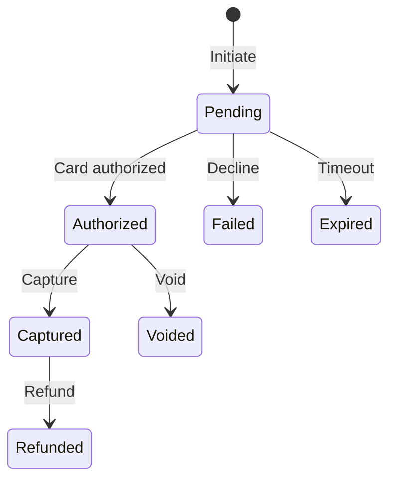

**UI references**
- `Payment.razor`

**API references**
- `POST /api/payments/{poId:guid}/initiate`
- `POST /api/payments/{paymentId:guid}/capture`
- `POST /api/payments/{paymentId:guid}/void`
- `GET /api/payments/{poId:guid}/status`
- `POST /api/webhooks/omise`
- `POST /api/payment/{paymentId:guid}/refund`

---

### 6.8 Logistics & Shipment Tracking

**Module description**: Seller manually enters a logistics tracking number. Buyer views it in PO detail. No external logistics API is integrated.

**User stories**
- As a seller, I want to enter a tracking number after payment, so that the buyer knows the shipment status.
- As a buyer, I want to click a tracking link to view delivery progress, so that I can plan receipt.

**Detailed requirements**
- FR-LOG-001: The system shall allow the seller to set tracking info (`ShipmentInfo`) on a PO in `CaptureInProgress` or `Contract`.
- FR-LOG-002: The system shall store carrier name, tracking number, and tracking URL.
- FR-LOG-003: The system shall expose tracking info publicly (no auth required) for convenience.

**Acceptance criteria**
- AC-LOG-001: Tracking info is visible on `PoDetail.razor` as a clickable link.

**UI references**
- `PoDetail.razor`

**API references**
- `POST /api/pos/{id:guid}/tracking`
- `GET /api/pos/{id:guid}/tracking`

---

### 6.9 Notification System (In-app, Email, Line OA)

**Module description**: Multi-channel notification dispatch. Staged write pattern ensures atomicity with triggering events. Hangfire job polls every 2 minutes.

**User stories**
- As a user, I want to receive in-app notifications for key events, so that I never miss an offer selection or payment confirmation.
- As a user, I want email and Line notifications as backups, so that I am informed even when offline.

**Detailed requirements**
- FR-NOTIF-001: The system shall stage in-app notifications atomically with state changes (`NotificationService.Stage`).
- FR-NOTIF-002: The system shall dispatch unsent notifications every 2 minutes via `DispatchNotificationsJob`.
- FR-NOTIF-003: The system shall send emails via SendGrid in production (`SendGridEmailSender`).
- FR-NOTIF-004: The system shall send Line OA push messages in production (`LineOaSender`).
- FR-NOTIF-005: The system shall mark notifications as read individually or in bulk.

**Acceptance criteria**
- AC-NOTIF-001: Notification staging does not call `SaveChangesAsync`—the caller saves once.
- AC-NOTIF-002: Unsent notifications older than the job interval are reliably dispatched.

**UI references**
- `Notifications.razor`

**API references**
- `GET /api/notifications`
- `PATCH /api/notifications/mark-all-read`
- `PATCH /api/notifications/{id:guid}/read`

---

### 6.10 Real-time Chat & Communication

**Module description**: Per-PO SignalR chat room. Messages persisted to PostgreSQL.

**User stories**
- As a buyer, I want to chat with the seller in real-time within the PO context, so that we can coordinate delivery details.
- As a seller, I want to see chat threads listed, so that I can manage multiple conversations.

**Detailed requirements**
- FR-CHAT-001: The system shall provide a SignalR hub (`ChatHub.cs`) for real-time messaging.
- FR-CHAT-002: The system shall persist all messages to `ChatMessage` table.
- FR-CHAT-003: The system shall list chat threads for the authenticated user (`GET /api/chat/threads`).
- FR-CHAT-004: The system shall paginate message history per PO.

**Acceptance criteria**
- AC-CHAT-001: Messages appear in real-time without page refresh.
- AC-CHAT-002: Only buyer and seller involved in the PO can access the chat room.

**UI references**
- `Chat.razor`, `ChatRoom.razor`

**API references**
- `GET /api/chat/threads`
- `GET /api/po/{id:guid}/messages`
- `POST /api/po/{id:guid}/messages`

---

### 6.11 Rating & Reputation System

**Module description**: Post-trade mutual rating (1–5 stars + optional comment). Public reputation profiles.

**User stories**
- As a buyer, I want to rate the seller after a fulfilled deal, so that future buyers benefit from my experience.
- As a seller, I want to rate the buyer, so that good buyers are recognized.
- As a user, I want to view a public reputation profile before trading, so that I can assess trust.

**Detailed requirements**
- FR-RATE-001: The system shall allow both parties to submit a rating only after PO reaches `Fulfilled`.
- FR-RATE-002: The system shall store star rating (1–5), comment, and timestamp in `TradeRating`.
- FR-RATE-003: The system shall update aggregated `BuyerScore` and `SellerScore` on the `User` entity.
- FR-RATE-004: The system shall expose public reputation endpoint with averages and recent reviews.

**Acceptance criteria**
- AC-RATE-001: Duplicate ratings on the same PO by the same user are prevented.
- AC-RATE-002: Ratings are visible on `ReputationProfile.razor`.

**UI references**
- `RatingForm.razor`, `PoDetail.razor`, `ReputationProfile.razor`

**API references**
- `POST /api/po/{id:guid}/rating`
- `GET /api/po/{id:guid}/ratings`
- `GET /api/users/{id}/reputation`

---

### 6.12 Audit Trail & Compliance

**Module description**: Immutable, hash-chained audit log. Every significant state change appends an `AuditEvent` with SHA-256 hash linking.

**User stories**
- As an admin, I want an immutable log of all state changes, so that I can detect tampering.
- As a regulator, I want proof that records have not been altered, so that the platform is trustworthy.

**Detailed requirements**
- FR-AUDIT-001: The system shall append an `AuditEvent` on every significant state change.
- FR-AUDIT-002: The system shall compute `Hash = SHA256(PrevHash + Payload)` under `pg_advisory_xact_lock(8675309)`.
- FR-AUDIT-003: The system shall run `VerifyAuditChainJob` daily to detect hash mismatches.
- FR-AUDIT-004: The system shall expose admin-only endpoints to list events and trigger verification.

**Acceptance criteria**
- AC-AUDIT-001: Tampering with any row invalidates all subsequent hashes (verified by daily job).
- AC-AUDIT-002: Audit events are never written without their parent entity change (staged write pattern).

**UI references**
- None in MVP (admin UI deferred).

**API references**
- `GET /api/admin/audit`
- `POST /api/admin/audit/verify`
- `PATCH /api/dev/audit-tamper/{id:guid}` (dev only)
- `POST /api/dev/make-admin/{email}` (dev only)

---

### 6.13 Dispute Resolution

**Module description**: Users can raise disputes on a PO. Admin is notified. Resolution is manual in MVP.

**User stories**
- As a buyer or seller, I want to raise a dispute if the other party breaches the deal, so that the admin can intervene.
- As an admin, I want to be notified of disputes immediately, so that I can take action.

**Detailed requirements**
- FR-DISP-001: The system shall allow either party to raise a dispute on a PO.
- FR-DISP-002: The system shall prevent duplicate open disputes on the same PO.
- FR-DISP-003: The system shall notify admin and the counterparty when a dispute is raised.
- FR-DISP-004: The system shall store dispute state (`DisputeState`: `Open`, `UnderReview`, `Resolved`, `Rejected`).

**Acceptance criteria**
- AC-DISP-001: Dispute data is visible in `PoDetail.razor`.
- AC-DISP-002: Admin can freeze the PO during dispute review.

**UI references**
- `PoDetail.razor`

**API references**
- `POST /api/pos/{id:guid}/dispute`
- `GET /api/pos/{id:guid}/dispute`

---

### 6.14 Tax & Invoicing

**Module description**: Generates Thai VAT 7% tax invoice as HTML for fulfilled deals.

**User stories**
- As a buyer, I want to download a tax invoice after the deal is fulfilled, so that I can claim VAT.

**Detailed requirements**
- FR-TAX-001: The system shall generate an HTML invoice including PO details, buyer/seller info, line items, subtotal, VAT 7%, and total.
- FR-TAX-002: The system shall expose the invoice only to the PO owner when state is `Fulfilled`.

**Acceptance criteria**
- AC-TAX-001: Invoice is printable from `PoDetail.razor`.

**UI references**
- `PoDetail.razor`

**API references**
- `GET /api/pos/{id:guid}/invoice`

---

### 6.15 Admin & Operations

**Module description**: Admin capabilities exist as API endpoints and Hangfire jobs. No dedicated admin dashboard in MVP.

**User stories**
- As an admin, I want to freeze a fraudulent PO, so that no further state transitions occur.
- As an admin, I want to verify the audit chain, so that I can confirm system integrity.

**Detailed requirements**
- FR-ADMIN-001: The system shall allow admin to freeze any PO (`Frozen` state).
- FR-ADMIN-002: The system shall allow admin to trigger audit verification on demand.
- FR-ADMIN-003: The system shall allow admin to process payment refunds.

**UI references**
- None (deferred to post-MVP admin app).

**API references**
- `POST /api/pos/{id:guid}/freeze`
- `POST /api/admin/audit/verify`
- `POST /api/payment/{paymentId:guid}/refund`

---

## 7. Non-Functional Requirements

### 7.1 Performance Requirements
| Requirement | Target |
|-------------|--------|
| API p95 response time | < 200 ms for read endpoints |
| Marketplace list query | < 100 ms (no-tracking + projection) |
| WASM bundle size | < 5 MB compressed |
| Payment initiation | < 3 seconds (Omise API latency) |
| Chat message delivery | < 200 ms (SignalR) |

### 7.2 Security Requirements
- All API communication over HTTPS in production (HSTS enforced).
- JWT access tokens short-lived (15 min); refresh token rotation on use.
- Rate limiting: `auth` policy throttles login/OTP endpoints; global policy protects all routes.
- Input validation: FluentValidation or native `DataAnnotations` on all DTOs.
- Secrets: `OmiseSecretKey`, `SendGrid:ApiKey`, `LineOa:ChannelAccessToken` stored in environment variables or Azure Key Vault—never committed.
- `RowVersion` on `PurchaseOrder` and `Offer` prevents lost-update races.

### 7.3 Reliability & Availability
- Uptime target: 99.9% during business hours (06:00–20:00 ICT).
- Hangfire jobs must be idempotent and retryable.
- `AutoConfirmPodJob` and `ExpirePoJob` include compensation logic (deposit release/credit).
- Database migrations are backward-compatible for zero-downtime deploys.

### 7.4 Scalability
- API is stateless; horizontal scaling via container orchestration.
- PostgreSQL connection pooling (default .NET `Npgsql` pool size).
- Redis used for distributed idempotency and SignalR backplane (if scaled out).
- WASM client is static files—served via CDN.

### 7.5 Compliance & Legal
- **PDPA**: Consent modal on first login; `User.PdpaConsentedAt` stored permanently.
- **VAT**: Invoice includes 7% VAT per Thai Revenue Department rules.
- **Tax records**: Audit log serves as tamper-evident transaction record.
- **Anti-fraud**: Deposit forfeiture and freeze capabilities mitigate payment default risk.

### 7.6 Internationalization (i18n)
- Supported languages: Thai (default) and English.
- Language toggle in UI (`LanguageService.cs`, `IStringLocalizer`).
- All user-facing strings externalized in localization dictionaries.
- No RTL requirement (Thai is LTR).

### 7.7 Observability
- Structured logging (Serilog or .NET Logger) with correlation IDs.
- Health checks endpoint (`/health`) for load balancer probes.
- Metrics: API request rate, error rate, Hangfire job success rate, SignalR connection count.
- Audit verification alert: `VerifyAuditChainJob` logs warning on tamper detection.

---

## 8. Domain Model & Data Architecture

### 8.1 Entity Relationship Overview

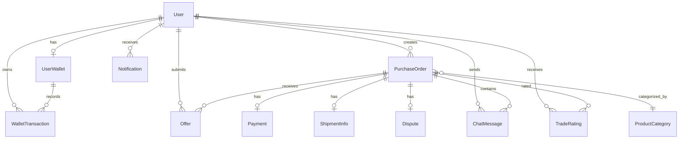

### 8.2 Key Data Fields per Entity

**User**
| Field | Type | Constraints | Description |
|-------|------|-------------|-------------|
| Id | string | PK | Clerk-style identifier |
| Email | string | Unique, required | Login credential |
| DisplayName | string | Required | Public name |
| PhoneNumber | string | Unique | OTP target |
| Role | string | User / Admin | Authorization role |
| BuyerScore | decimal | Nullable | Aggregated buyer rating |
| SellerScore | decimal | Nullable | Aggregated seller rating |
| KycStatus | string | Nullable | Unverified in MVP |
| PdpaConsentedAt | DateTime? | | Consent timestamp |

**UserWallet**
| Field | Type | Constraints | Description |
|-------|------|-------------|-------------|
| Id | Guid | PK | |
| UserId | string | FK → User | One-to-one |
| AvailableBalance | decimal | ≥ 0 | Spendable funds |
| HeldBalance | decimal | ≥ 0 | Locked deposits |
| RowVersion | uint | Concurrency token | Optimistic locking |

**WalletTransaction**
| Field | Type | Constraints | Description |
|-------|------|-------------|-------------|
| Id | Guid | PK | |
| UserId | string | FK → User | |
| Type | WalletTxType | Enum | TopUp, Hold, Release, etc. |
| Amount | decimal | | Positive or negative |
| CreatedAt | DateTime | | Immutable |

**PurchaseOrder**
| Field | Type | Constraints | Description |
|-------|------|-------------|-------------|
| Id | Guid | PK | |
| BuyerId | string | FK → User | |
| CategoryId | Guid | FK → ProductCategory | |
| State | PoState | Enum | 10 states |
| Quantity | decimal | > 0 | Requested qty |
| TargetPrice | decimal | ≥ 0 | Buyer target |
| DeliveryAddress | string | | |
| Deadline | DateTime? | | Delivery deadline |
| RowVersion | uint | Concurrency token | |

**Offer**
| Field | Type | Constraints | Description |
|-------|------|-------------|-------------|
| Id | Guid | PK | |
| PoId | Guid | FK → PurchaseOrder | |
| SellerId | string | FK → User | |
| State | OfferState | Enum | 5 states |
| OfferedPrice | decimal | > 0 | Seller price |
| OfferedQuantity | decimal | > 0 | Seller qty |
| DepositAmount | decimal | ≥ 0 | Computed 10% |
| RowVersion | uint | Concurrency token | |

**Payment**
| Field | Type | Constraints | Description |
|-------|------|-------------|-------------|
| Id | Guid | PK | |
| PoId | Guid | FK → PurchaseOrder | |
| State | PaymentState | Enum | 6 states |
| Amount | decimal | > 0 | Charged amount |
| OmiseChargeId | string | | Gateway reference |
| MetadataJson | string | | `type` field for branching |

**AuditEvent**
| Field | Type | Constraints | Description |
|-------|------|-------------|-------------|
| Id | Guid | PK | |
| EntityType | string | | Table name |
| EntityId | string | | Record ID |
| EventType | string | | Action name |
| ActorId | string | | Who acted |
| Payload | string | JSON | State snapshot |
| PrevHash | string | | Previous hash |
| Hash | string | | SHA-256 chain |
| CreatedAt | DateTime | | |

### 8.3 Enumeration Reference

**PoState** (`src/Shared/Enums/PoState.cs`)
| Value | Meaning |
|-------|---------|
| Draft | Created, not visible |
| Open | Published, accepting offers |
| AwaitingSellerConfirm | Offer selected, awaiting seller |
| PaymentPending | Seller confirmed, awaiting buyer payment |
| CaptureInProgress | Payment webhook received, logistics pending |
| Contract | Shipment booked, goods in transit |
| Fulfilled | POD confirmed, deal complete |
| Expired | 30-day timeout with no selection |
| Cancelled | Buyer cancelled |
| Frozen | Admin-frozen |
| OffPlatform | Deal moved outside platform |

**OfferState** (`src/Shared/Enums/OfferState.cs`)
| Value | Meaning |
|-------|---------|
| Open | Submitted, visible to buyer |
| Accepted | Buyer selected |
| Rejected | Buyer rejected or seller timed out |
| Withdrawn | Seller withdrew before selection |
| Fulfilled | Delivery confirmed, deposit released |

**PaymentState** (`src/Shared/Enums/PaymentState.cs`)
| Value | Meaning |
|-------|---------|
| Pending | Charge initiated |
| Authorized | Card authorized |
| Captured | Funds captured |
| Voided | Cancelled before capture |
| Failed | Declined or error |
| Refunded | Refunded after capture |
| Expired | Charge expired |

**WalletTxType** (`src/Shared/Enums/WalletTxType.cs`)
| Value | Meaning |
|-------|---------|
| TopUp | Wallet deposit |
| Hold | Deposit locked |
| Release | Deposit returned |
| Forfeit | Seller deposit forfeited |
| ForfeitCompensation | Buyer receives 50% of forfeit |
| Payment | Buyer wallet deducted |
| Refund | Reversal |
| Fee | Platform fee (future) |

**DisputeState** (`src/Shared/Enums/DisputeState.cs`)
| Value | Meaning |
|-------|---------|
| Open | Dispute filed |
| UnderReview | Admin investigating |
| Resolved | Decision reached |
| Rejected | Dismissed |

---

## 9. State Machines

### 9.1 Purchase Order State Machine

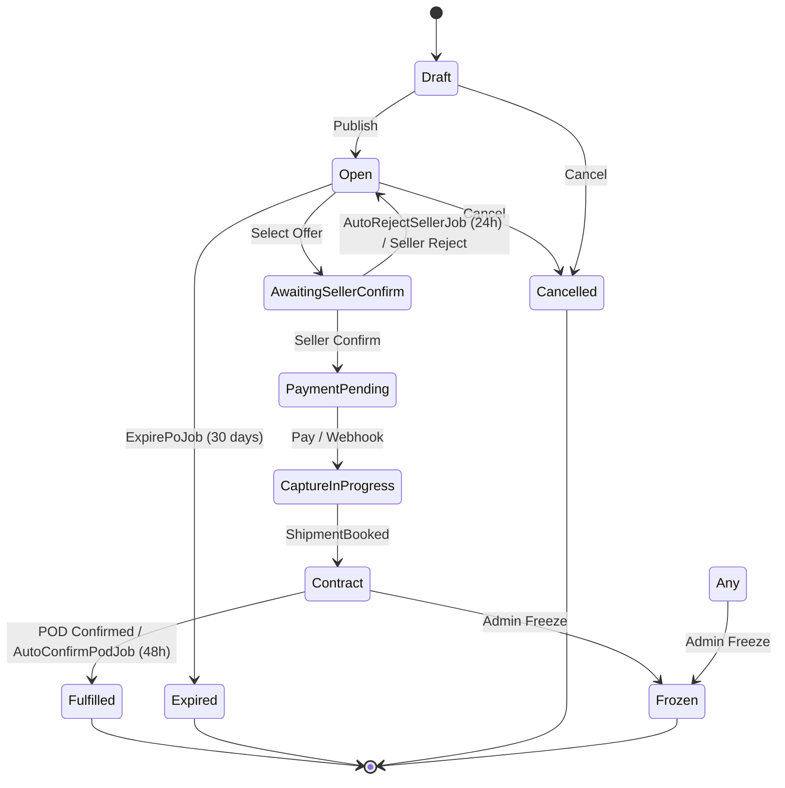

### 9.2 Offer State Machine

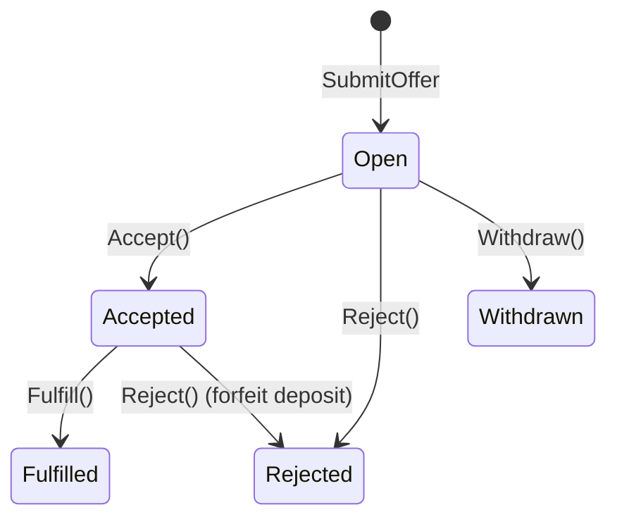

### 9.3 Payment State Machine

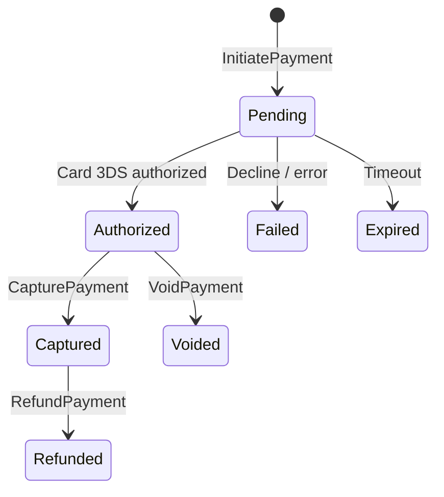

### 9.4 Dispute State Machine

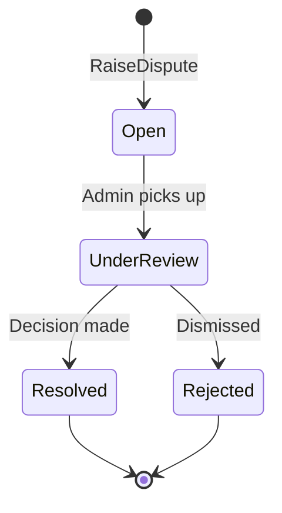

---

## 10. API Contract Overview

### 10.1 API Design Principles
- **RESTful** resource naming (`/api/pos`, `/api/wallet`, etc.).
- **Minimal API** pattern: single-file endpoint modules mapping routes to handler methods.
- **JWT Bearer** auth on all mutating endpoints; anonymous allowed only for marketplace browse, categories, tracking, and webhooks.
- **Consistent error shape**: ProblemDetails with typed exceptions mapped to HTTP status codes.

### 10.2 Endpoint Inventory

**Authentication**
| Method | Route | Auth | Description |
|--------|-------|------|-------------|
| GET | /api/auth/me | Bearer | Current user |
| POST | /api/auth/send-otp | Anonymous | Request OTP |
| POST | /api/auth/verify-otp | Anonymous | Verify OTP & login |
| POST | /api/auth/register | Anonymous | Email registration |
| POST | /api/auth/login | Anonymous | Email login |
| POST | /api/auth/refresh | Anonymous | Rotate tokens |
| POST | /api/auth/logout | Anonymous | Invalidate refresh |
| POST | /api/auth/reset-password | Anonymous | Password reset |
| POST | /api/auth/pdpa-consent | Bearer | Record PDPA consent |

**Categories**
| Method | Route | Auth | Description |
|--------|-------|------|-------------|
| GET | /api/categories | Anonymous | List all |
| GET | /api/categories/{id:guid} | Anonymous | Get by ID |

**Purchase Orders**
| Method | Route | Auth | Description |
|--------|-------|------|-------------|
| GET | /api/pos | Anonymous | List open POs |
| GET | /api/pos/{id:guid} | Anonymous | Get PO detail |
| POST | /api/pos | Bearer | Create PO |
| PUT | /api/pos/{id:guid} | Bearer | Update PO |
| DELETE | /api/pos/{id:guid} | Bearer | Delete PO |
| POST | /api/pos/{id:guid}/publish | Bearer | Publish draft |
| PATCH | /api/pos/{id:guid}/cancel | Bearer | Cancel PO |
| POST | /api/pos/{id:guid}/seller-confirm | Bearer | Seller confirms |
| POST | /api/pos/{id:guid}/seller-reject | Bearer | Seller rejects |
| POST | /api/pos/{id:guid}/expire | Bearer | Admin/manual expire |
| POST | /api/pos/{id:guid}/freeze | Bearer | Admin freeze |
| POST | /api/pos/{id:guid}/payment-captured | Bearer | Webhook bridge |
| POST | /api/pos/{id:guid}/shipment-booked | Bearer | Seller sets shipment |
| POST | /api/pos/{id:guid}/pod-confirmed | Bearer | Buyer confirms POD |
| POST | /api/pos/{id:guid}/tracking | Bearer | Set tracking info |
| GET | /api/pos/{id:guid}/tracking | Anonymous | View tracking |
| POST | /api/pos/{id:guid}/dispute | Bearer | Raise dispute |
| GET | /api/pos/{id:guid}/dispute | Bearer | Get dispute |
| GET | /api/pos/{id:guid}/invoice | Bearer | Tax invoice HTML |

**Offers**
| Method | Route | Auth | Description |
|--------|-------|------|-------------|
| GET | /api/pos/{poId:guid}/offers | Bearer | List offers on PO |
| GET | /api/pos/{poId:guid}/offers/{offerId:guid} | Bearer | Get offer |
| POST | /api/pos/{poId:guid}/offers | Bearer | Submit offer |
| POST | /api/pos/{poId:guid}/offers/{offerId:guid}/withdraw | Bearer | Withdraw offer |
| POST | /api/offers/{offerId:guid}/select | Bearer | Buyer selects offer |
| GET | /api/offers/mine | Bearer | My submitted offers |

**Payments**
| Method | Route | Auth | Description |
|--------|-------|------|-------------|
| POST | /api/payments/{poId:guid}/initiate | Bearer | Start payment |
| POST | /api/payments/{paymentId:guid}/capture | Bearer | Capture authorized |
| POST | /api/payments/{paymentId:guid}/void | Bearer | Void authorized |
| GET | /api/payments/{poId:guid}/status | Bearer | Payment status |

**Wallet**
| Method | Route | Auth | Description |
|--------|-------|------|-------------|
| GET | /api/wallet | Bearer | Wallet summary |
| GET | /api/wallet/transactions | Bearer | Transaction history |
| POST | /api/wallet/dev-topup | Bearer | Dev-only top-up |
| POST | /api/wallet/topup/initiate | Bearer | Real top-up |
| GET | /api/wallet/topup/status/{chargeId} | Bearer | Top-up status |
| POST | /api/wallet/withdraw | Bearer | Request withdrawal |

**Notifications**
| Method | Route | Auth | Description |
|--------|-------|------|-------------|
| GET | /api/notifications | Bearer | My notifications |
| PATCH | /api/notifications/mark-all-read | Bearer | Mark all read |
| PATCH | /api/notifications/{id:guid}/read | Bearer | Mark one read |

**Chat**
| Method | Route | Auth | Description |
|--------|-------|------|-------------|
| GET | /api/chat/threads | Bearer | List chat threads |
| GET | /api/po/{id:guid}/messages | Bearer | Get messages |
| POST | /api/po/{id:guid}/messages | Bearer | Send message |

**Ratings**
| Method | Route | Auth | Description |
|--------|-------|------|-------------|
| POST | /api/po/{id:guid}/rating | Bearer | Submit rating |
| GET | /api/po/{id:guid}/ratings | Bearer | View ratings |

**Users**
| Method | Route | Auth | Description |
|--------|-------|------|-------------|
| GET | /api/users/{id}/reputation | Anonymous | Public reputation |

**Webhooks & Admin**
| Method | Route | Auth | Description |
|--------|-------|------|-------------|
| POST | /api/webhooks/omise | Anonymous | Omise events |
| POST | /api/payment/{paymentId:guid}/refund | Bearer | Admin refund |
| GET | /api/admin/audit | Bearer (Admin) | List audit events |
| POST | /api/admin/audit/verify | Bearer (Admin) | Verify chain |
| PATCH | /api/dev/audit-tamper/{id:guid} | Anonymous (Dev) | Tamper test |
| POST | /api/dev/make-admin/{email} | Anonymous (Dev) | Promote user |

### 10.3 Authentication & Authorization
- **JWT**: Short-lived access token + long-lived refresh token stored server-side.
- **Test endpoints**: `POST /api/auth/test-register` and `POST /api/auth/test-login` create dev accounts without password.
- **Role-based**: `[Authorize(Roles = "Admin")]` on audit and refund endpoints.

### 10.4 Idempotency & Concurrency
- **Redis idempotency**: `IdempotencyMiddleware` stores UUID keys with 24h TTL for payment and top-up requests.
- **Optimistic concurrency**: `RowVersion` on `PurchaseOrder` and `Offer`.
- **Advisory lock**: `pg_advisory_xact_lock(8675309)` in `AgriDbContext.SaveChangesAsync` serializes audit hash computation.

---

## 11. UI/UX Requirements

### 11.1 Design System
- **Framework**: MudBlazor v7 (Material Design components for Blazor).
- **Responsive**: Mobile-first layout; grid collapses to single column on small screens.
- **Color palette**: Primary green (#2E7D32) for agriculture trust; accent amber for warnings; red for errors.
- **Typography**: Noto Sans Thai for Thai glyphs; Roboto for English.
- **Icons**: Material Icons via MudBlazor.

### 11.2 Page Inventory

| Page Name | Route | Actor | Purpose | Key Components |
|-----------|-------|-------|---------|----------------|
| Home | `/` | All | Landing | Hero, category cards |
| Login | `/login` | Anonymous | Authenticate | Login form, OTP option |
| Register | `/register` | Anonymous | Create account | Registration form |
| ForgotPassword | `/forgot-password` | Anonymous | Reset password | Email input |
| OAuthCallback | `/oauth/callback` | Anonymous | External auth | Redirect handler |
| Dashboard | `/dashboard` | Auth | Overview | Stats, quick links |
| Marketplace | `/marketplace` | All | Browse open POs | PO cards, filters |
| ProductPos | `/marketplace/{category}` | All | Category-scoped browse | PO list |
| PoNew | `/po/new` | Buyer | Create PO | Form, category picker |
| PoDetail | `/po/{id}` | All | PO lifecycle hub | State badge, offer list, tracking, chat, rating, invoice |
| MyPos | `/my/pos` | Buyer | Manage my POs | Table, status chips |
| OfferNew | `/po/{id}/offer` | Seller | Submit offer | Price/qty inputs |
| MyOffers | `/my/offers` | Seller | My offer history | Table, status chips |
| Wallet | `/wallet` | Auth | Balance & top-up | Balance cards, tx list, QR/card top-up |
| Payment | `/payment/{poId}` | Buyer | Pay for PO | Card form, QR display |
| Notifications | `/notifications` | Auth | In-app alerts | List, mark-read |
| Chat | `/chat` | Auth | Chat threads | Thread list |
| ChatRoom | `/chat/{poId}` | Auth | Real-time PO chat | SignalR messages, input |
| Profile | `/profile` | Auth | Edit profile | Form |
| ReputationProfile | `/reputation/{userId}` | All | Public ratings | Stars, reviews |
| Settings | `/settings` | Auth | App settings | Language toggle |
| Activity | `/activity` | Auth | Recent events | Feed |
| Help | `/help` | All | Support info | FAQ |
| NotFound | `/*` | All | 404 page | Message |

### 11.3 Critical User Flows

**Register → Create PO → Select Offer → Pay → Confirm POD → Rate**
1. **Register**: User visits `/register`, chooses email or phone OTP, submits. PDPA modal appears on first login.
2. **Top-up**: User visits `/wallet`, clicks "เติมเงิน", selects PromptPay or card, completes Omise flow.
3. **Create PO**: Buyer visits `/po/new`, selects category, enters quantity/price/address/deadline, saves draft.
4. **Publish**: Buyer clicks "เผยแพร่" on `MyPos.razor` or `PoDetail.razor`. PO moves to `Open`.
5. **Offers arrive**: Sellers browse `/marketplace` and submit offers. Buyer sees offers in `PoDetail.razor`.
6. **Select**: Buyer clicks "เลือกข้อเสนอนี้". PO moves to `AwaitingSellerConfirm`.
7. **Confirm**: Seller clicks "ยืนยันดีล" within 24h. PO moves to `PaymentPending`.
8. **Pay**: Buyer visits `/payment/{poId}`, chooses card or QR, pays. Webhook moves PO to `Contract`.
9. **Track**: Seller enters tracking number in `PoDetail.razor`.
10. **POD**: Buyer clicks "ยืนยันรับสินค้า". PO moves to `Fulfilled`. Deposit released.
11. **Rate**: Both parties see `RatingForm.razor` in `PoDetail.razor`, submit 1–5 stars + comment.
12. **Invoice**: Buyer clicks "พิมพ์ใบกำกับภาษี" to open HTML invoice.

### 11.4 Accessibility
- All interactive elements reachable via keyboard (`Tab` order logical).
- MudBlazor components provide ARIA attributes by default.
- Color contrast ratios meet WCAG 2.1 AA.
- Form validation errors announced via screen-reader-friendly `MudText` with `role="alert"`.

---

## 12. Security & Compliance

### 12.1 Authentication Security
- JWT access token expiry: 15 minutes.
- Refresh token rotation: new refresh token issued on every refresh; old one invalidated.
- OTP PIN in dev is `000000` for testability; production uses secure random generation.
- Brute-force protection: `auth` rate-limit policy on `/api/auth/login` and `/api/auth/send-otp`.

### 12.2 Data Protection
- **PDPA modal**: Blocks all navigation until consent is given. Records `User.PdpaConsentedAt`.
- **No PII in logs**: Email, phone, and address are excluded from structured logs.
- **Encryption in transit**: TLS 1.2+ enforced in production.

### 12.3 Payment Security
- **3D Secure**: Card payments redirect to issuer verification.
- **Webhook HMAC**: Omise webhook payload signature verified before processing.
- **Idempotency**: Redis key prevents duplicate charges on client retry.

### 12.4 Audit Integrity
- **SHA-256 chain**: `Hash = SHA256(PrevHash + Payload)`. Starts from `GENESIS`.
- **Daily verification**: `VerifyAuditChainJob` recomputes expected hashes; logs warning on mismatch.
- **Tamper detection**: `PATCH /api/dev/audit-tamper/{id:guid}` exists in dev to simulate tampering and verify detection.

### 12.5 Infrastructure Security
- **HTTPS/HSTS**: Enforced in production via middleware.
- **Security headers**: `X-Content-Type-Options`, `X-Frame-Options`, `Referrer-Policy`.
- **Rate limiting**: Global + auth-specific policies.
- **CORS**: Restricted to known origins.

---

## 13. MVP Acceptance Criteria

### 13.1 End-to-End Demo Script
1. Register Buyer and Seller accounts via phone OTP.
2. Both users top-up wallet via Omise PromptPay QR (or `POST /api/wallet/dev-topup`).
3. Buyer creates and publishes a PO.
4. Seller submits an offer; verify 10% deposit is held.
5. Buyer selects the offer.
6. Seller confirms within 24 hours.
7. Buyer pays via Omise; webhook confirms.
8. PO reaches `Contract` state.
9. Buyer confirms POD (or wait 48h for `AutoConfirmPodJob`).
10. PO reaches `Fulfilled`; seller deposit released.
11. Both parties submit ratings.
12. Run `POST /api/admin/audit/verify` → response indicates 0 errors.

### 13.2 Feature Completion Checklist

| Feature | Status | Verification Method |
|---------|--------|---------------------|
| Auth (OTP + Email) | Done | Unit tests + E2E |
| JWT Access/Refresh | Done | Unit tests |
| Wallet (top-up, hold, release) | Done | Integration tests |
| Product categories | Done | Seed data inspection |
| PO state machine | Done | Unit tests on entity |
| Offer + deposit | Done | Integration tests |
| Payment (Omise card + QR) | Done | E2E + webhook test |
| Shipment tracking | Done | API test |
| Dispute flow | Done | API test |
| Notifications (in-app, email, Line) | Done | Job + mock sender test |
| PDPA consent | Done | E2E |
| Tax invoice | Done | HTML render test |
| Audit chain | Done | Daily job + tamper test |
| Real-time chat | Done | SignalR integration test |
| Ratings & reputation | Done | API + UI test |
| i18n (Thai/English) | Done | UI inspection |
| Production hardening | Done | Security header scan |
| CI/CD pipeline | Done | GitHub Actions run |

### 13.3 Known Gaps Before Production
1. **Omise keys**: `OmisePublicKey` and `OmiseSecretKey` must be configured in production.
2. **HTTPS**: Requires TLS termination at reverse proxy.
3. **SendGrid API key**: Must be set in production config.
4. **Line OA channel access token**: Must be set in production config.
5. **Admin dashboard web app**: Out of MVP scope; current admin actions are API-only.

---

## 14. Out of Scope

### 14.1 Post-MVP Features
- KYC / NDID e-KYC identity verification
- Insurance / quality-protection claims
- PaySo payment gateway (deferred per ADR-004)
- Installment payments
- Logistics API integration (FLASH, Kerry)

### 14.2 Deferred Admin Functions
- Admin dashboard web application (freeze/unfreeze user UI, visual dispute resolution panel)
- Bulk user import/export
- Advanced analytics and reporting UI

### 14.3 Technical Debt Items
- Refactor `Pages/` into deep modules (client architecture deepening — planned)
- Consolidate endpoint CRUD patterns into reusable deep modules
- Extract Omise webhook handlers into pluggable provider interface

---

## 15. Success Metrics & KPIs

### 15.1 Business Metrics
| Metric | Target |
|--------|--------|
| GMV (Gross Merchandise Value) per month | > 1M THB by month 6 |
| Offer acceptance rate | > 60% |
| Dispute rate | < 2% of fulfilled deals |
| Net Promoter Score (NPS) | > 40 |

### 15.2 Technical Metrics
| Metric | Target |
|--------|--------|
| API p95 latency | < 200 ms |
| Error rate | < 0.5% |
| Test coverage | > 70% |
| Audit chain integrity | 100% (zero mismatches) |

### 15.3 Operational Metrics
| Metric | Target |
|--------|--------|
| Notification dispatch lag | < 5 minutes |
| Payment success rate | > 95% |
| Wallet top-up success rate | > 98% |

---

## 16. Dependencies & Constraints

### 16.1 External Dependencies
| Service | Purpose | MVP Critical |
|---------|---------|------------|
| Omise | Card & PromptPay payments, wallet top-up | Yes |
| SendGrid | Transactional email delivery | Yes |
| Line Messaging API | Push notifications | Yes |
| PostgreSQL | Primary database | Yes |
| Redis | Idempotency, caching, SignalR backplane | Yes |
| Hangfire | Background job scheduling | Yes |

### 16.2 Technical Constraints
- **.NET 8/9**: Backend runtime and Minimal APIs.
- **Blazor WASM**: Client-side runtime; requires API for all data.
- **Entity Framework Core**: ORM with PostgreSQL provider.
- **MudBlazor v7**: UI component library; `@bind-Visible` used for dialogs (not `@bind-IsVisible`).

### 16.3 Business Constraints
- **10% deposit rule**: Hard-coded in `DepositLedgerService`. Any change requires ADR update.
- **30-day PO expiry**: `ExpirePoJob` runs on 30-day cron from publish date.
- **24h seller confirm**: `AutoRejectSellerJob` enforces 24-hour confirmation window.
- **48h auto-POD**: `AutoConfirmPodJob` fulfills PO if buyer does not confirm within 48 hours of `Contract`.

---

## 17. Risks & Mitigations

### 17.1 Technical Risks
| Risk | Impact | Mitigation |
|------|--------|------------|
| Payment gateway downtime | High | Retry logic + idempotency keys; buyer can retry QR |
| Audit chain corruption | Critical | Daily `VerifyAuditChainJob` + advisory lock |
| Race conditions on PO/Offer | Medium | `RowVersion` optimistic concurrency + advisory lock |
| SignalR scale-out | Medium | Redis backplane if moving to multiple API instances |

### 17.2 Business Risks
| Risk | Impact | Mitigation |
|------|--------|------------|
| Low seller adoption | High | Zero platform fee at launch; deposit is refundable |
| Buyer payment defaults | Medium | Deposit forfeiture + reputation score impact |
| Regulatory changes | Medium | Modular tax/invoice layer; PDPA consent is versioned |

### 17.3 Operational Risks
| Risk | Impact | Mitigation |
|------|--------|------------|
| Notification delivery failures | Medium | Dual-channel fallback (email + Line OA) |
| Dispute backlog | Medium | Admin Slack/email alerts on every dispute |
| Fraud (fake POs / offers) | Medium | Freeze capability + manual admin review |

---

## 18. Appendix

### 18.1 Glossary
| Term | Definition |
|------|------------|
| PO (Purchase Order) | Buyer's procurement request with quantity, price, deadline |
| Offer | Seller's bid on an open PO with price, quantity, deposit |
| Deposit | 10% of `offeredPrice × offeredQuantity`, held in wallet |
| POD (Proof of Delivery) | Buyer's confirmation that goods were received |
| Omise | Thai payment gateway supporting cards and PromptPay QR |
| PromptPay | Thai interbank real-time payment via mobile banking QR |
| Hangfire | .NET background job scheduler |
| SignalR | Real-time communication framework |
| PDPA | Personal Data Protection Act (Thailand) |
| VAT | Value Added Tax (7% in Thailand) |

### 18.2 Reference Documents
- `docs/architecture/ARCHITECTURE.md` — C4 diagrams and system context
- `docs/architecture/ADR.md` — Architecture Decision Records (ADR-001 through ADR-008+)
- `docs/architecture/TECH_STACK.md` — Technology stack and versions
- `docs/testing/TEST_STRATEGY.md` — Testing pyramid and tooling

### 18.3 Revision History
| Version | Date | Author | Changes |
|---------|------|--------|---------|
| 1.0 | 2025-Q1 | Product Team | Initial MVP PRD |
| 2.0 | 2026-05-31 | Product Team | Comprehensive rewrite: added all Sprint 1–9 features, endpoint inventory derived from code, page inventory derived from `src/Clients/Pages/`, chat, ratings, i18n, hardening, and full NFR suite |
