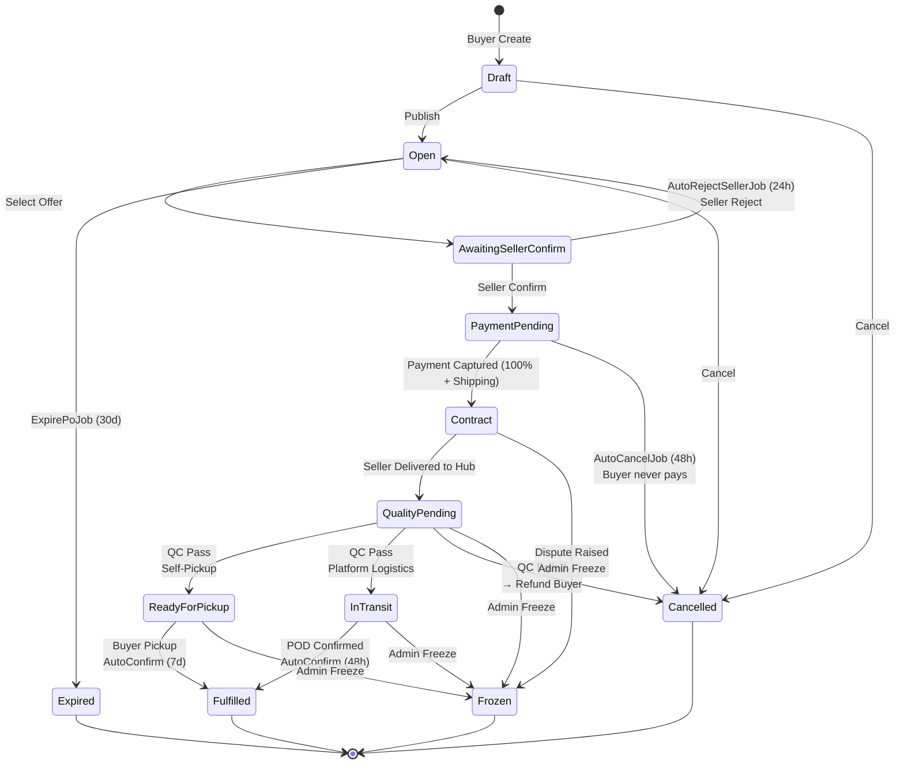
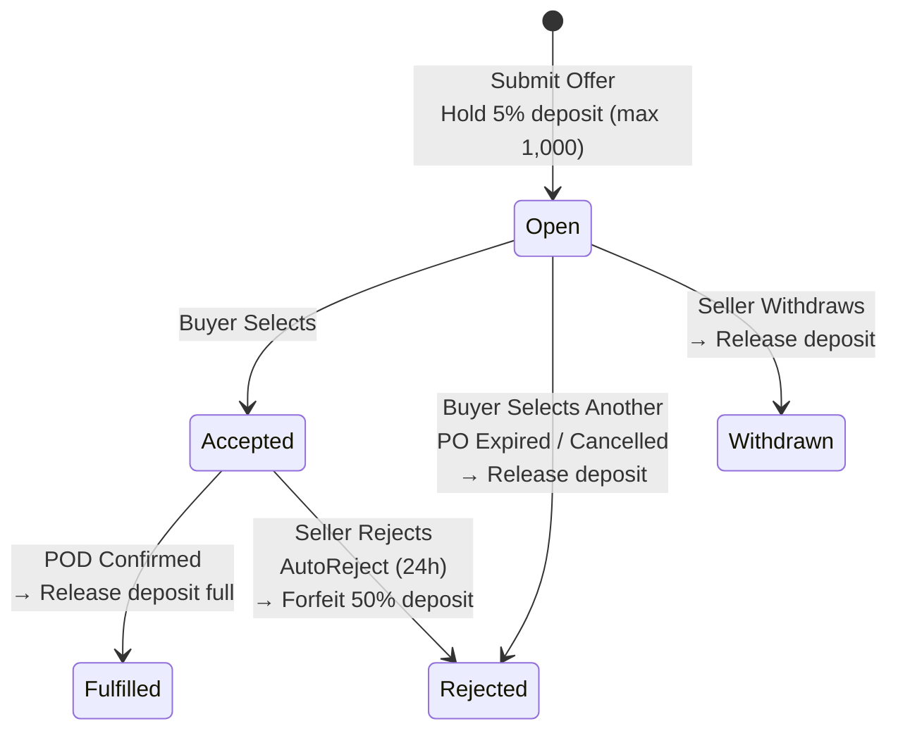
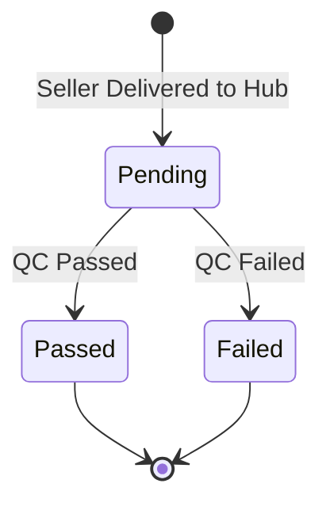
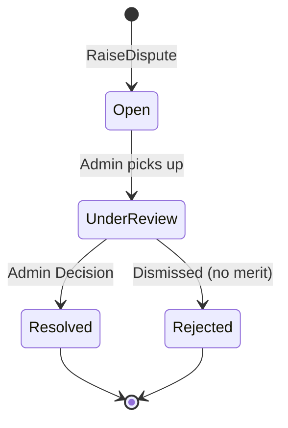

# State Machine Analysis — MVP Scope (Logistics-Enabled)

> เอกสารนี้สร้างขึ้นหลังจาก grill-with-docs session โดยปรับ State Machine ให้สอดคล้องกับ MVP scope ที่ตกลงกัน รวมถึงโมเดล **Platform Logistics + QC**

---

## 1. Purchase Order (PO) State Machine

### 1.1 สถานะทั้งหมด

| สถานะ | ความหมาย |
|-------|---------|
| **Draft** | Buyer กำลังสร้าง/แก้ไข PO ยังไม่เผยแพร่ |
| **Open** | PO เผยแพร่แล้ว รับ Offer จาก Seller |
| **AwaitingSellerConfirm** | Buyer เลือก Offer แล้ว รอ Seller ตอบรับภายใน 24 ชม. |
| **PaymentPending** | Seller ตอบรับแล้ว รอ Buyer จ่ายเงิน 100% + ค่าขนส่ง |
| **Contract** | เงินเข้า escrow แล้ว รอ Seller ส่งมอบที่ Hub |
| **QualityPending** | Seller ส่งมอบที่ Hub แล้ว รอแพลตฟอร์มตรวจ QC |
| **ReadyForPickup** | QC ผ่าน + Buyer เลือก Self-Pickup รอ Buyer มารับที่ Hub |
| **InTransit** | QC ผ่าน + Buyer เลือก Platform Logistics รอส่งถึง Buyer |
| **Fulfilled** | ดีลสำเร็จ เงินโอนให้ Seller + ค่าขนส่งเป็นรายได้แพลตฟอร์ม |
| **Expired** | PO หมดอายุ 30 วันหลัง publish |
| **Cancelled** | ดีลถูกยกเลิก (Buyer cancel / AutoCancel / QC Failed / etc.) |
| **Frozen** | Admin ระงับ (ข้อพิพาท หรือแทรกแซง) |

### 1.2 Diagram



### 1.3 การเปลี่ยนแปลงหลักจาก PRD v2.0

| รายการ | PRD v2.0 | MVP (ปรับแล้ว) | เหตุผล |
|--------|----------|----------------|--------|
| **CaptureInProgress** | มี state นี้ | ❌ ตัดออก | เป็น technical concern ของ payment gateway |
| **ShipmentBooked** | เป็น transition | ❌ ตัดออก | แพลตฟอร์มเป็นผู้จัดการขนส่งเอง |
| **QualityPending** ⭐ | ไม่มี | ✅ เพิ่ม | แพลตฟอร์มตรวจ QC ที่ Hub |
| **ReadyForPickup** ⭐ | ไม่มี | ✅ เพิ่ม | รองรับ Self-Pickup |
| **InTransit** ⭐ | ไม่มี | ✅ เพิ่ม | แพลตฟอร์มขนส่งเอง |
| **AutoCancelJob** | ไม่มี | ✅ เพิ่ม (48h) | ป้องกัน buyer ghost |
| **QC Failed → Cancelled** | ไม่มี | ✅ เพิ่ม | คืนเงินทั้งหมด |
| **Payment รวมค่าส่ง** | ไม่มีค่าส่ง | ✅ รวมค่าขนส่ง | รายได้แพลตฟอร์มจาก logistics |
| **Frozen จาก Dispute** | Admin Freeze เท่านั้น | Dispute → Frozen | ตาม BR-009 |
| **Auto-confirm Self-Pickup** | 48h เหมือนกัน | 7 วัน | ให้เวลา Buyer มารับ |

### 1.4 Guard Methods (Entity Level)

```csharp
// Pseudo-code for guard methods
PurchaseOrder.Publish()          // Draft → Open
PurchaseOrder.SelectOffer()      // Open → AwaitingSellerConfirm
PurchaseOrder.SellerConfirm()    // AwaitingSellerConfirm → PaymentPending
PurchaseOrder.SellerReject()     // AwaitingSellerConfirm → Open (forfeit 50% deposit)
PurchaseOrder.PaymentCapture()   // PaymentPending → Contract
PurchaseOrder.SellerDelivered()  // Contract → QualityPending
PurchaseOrder.QcPassPickup()     // QualityPending → ReadyForPickup
PurchaseOrder.QcPassShip()       // QualityPending → InTransit
PurchaseOrder.QcFail()           // QualityPending → Cancelled (refund all)
PurchaseOrder.PodConfirm()       // ReadyForPickup / InTransit → Fulfilled
PurchaseOrder.Freeze()           // Any active → Frozen
PurchaseOrder.Cancel()           // Draft / Open → Cancelled
```

### 1.5 กฎ Timeout (Hangfire Jobs)

| Job | Trigger | ผลลัพธ์ |
|-----|---------|---------|
| **ExpirePoJob** | 30 วันหลัง Publish | Open → Expired |
| **AutoRejectSellerJob** | 24 ชม. หลัง AwaitingSellerConfirm | AwaitingSellerConfirm → Open (forfeit deposit) |
| **AutoCancelJob** ⭐ | 48 ชม. หลัง PaymentPending | PaymentPending → Cancelled |
| **AutoConfirmPodJob** | 48 ชม. หลัง InTransit | InTransit → Fulfilled |
| **AutoConfirmPickupJob** ⭐ | 7 วันหลัง ReadyForPickup | ReadyForPickup → Fulfilled |

> ⭐ = new additions not in PRD v2.0

### 1.6 Side Effects ต่อ Offer & Wallet

| PO Transition | ผลต่อ Offers | เงิน Escrow | ค่าขนส่ง |
|---------------|--------------|-------------|----------|
| Open → AwaitingSellerConfirm | ที่ถูกเลือก → `Accepted` / ที่เหลือ → `Rejected` (คืนมัดจำ) | — | — |
| AwaitingSellerConfirm → Open | ที่ถูกเลือก → `Rejected` (ริบ 50% มัดจำ) | — | — |
| PaymentPending → Contract | — | เข้า escrow (100% + ค่าส่ง) | แช่ไว้ใน escrow |
| Contract → QualityPending | — | แช่ไว้ | แช่ไว้ |
| QualityPending → Cancelled | ที่ Accepted → `Rejected` (คืนมัดจำ) | **คืน Buyer ทั้งหมด** | คืน Buyer |
| QualityPending → ReadyForPickup | — | แช่ไว้ | แช่ไว้ |
| QualityPending → InTransit | — | แช่ไว้ | แช่ไว้ |
| ReadyForPickup → Fulfilled | Accepted → `Fulfilled` (คืนมัดจำเต็ม) | **โอนให้ Seller** | **รายได้แพลตฟอร์ม** |
| InTransit → Fulfilled | Accepted → `Fulfilled` (คืนมัดจำเต็ม) | **โอนให้ Seller** | **รายได้แพลตฟอร์ม** |
| Any → Expired / Cancelled | ทุก Offer → `Rejected` (คืนมัดจำ) | คืน Buyer | คืน Buyer |
| Any → Frozen | ทุก transition หยุดชะงัก | แช่ไว้ | แช่ไว้ |

### 1.7 เงินเข้า-ออก Escrow ตาม State

```
[Buyer จ่าย] ──► Escrow (Product + Shipping)
                      │
                      ├── QC Failed ──► [คืน Buyer ทั้งหมด]
                      │
                      ├── Cancelled ──► [คืน Buyer ทั้งหมด]
                      │
                      └── Fulfilled ──► [โอน Product ให้ Seller]
                                          [เก็บ Shipping เป็นรายได้]
```

---

## 2. Offer State Machine (ไม่เปลี่ยน)

เหมือนเดิมตาม MVP scope ที่ตกลงกัน:



| รายการ | ค่า |
|--------|------|
| **Deposit** | 5% ของมูลค่า Offer (ไม่เกิน 1,000 บาท) |
| **Forfeit** | 50% ของมัดจำ → เข้าแพลตฟอร์ม |
| **คืนเต็ม** | เมื่อไม่ถูกเลือก / ถอนตัว / QC Failed / ดีลสำเร็จ |

---

## 3. Quality Control (QC) State Machine (New)



| สถานะ | ผล |
|--------|-----|
| **QC Passed** | PO ไปต่อ (ReadyForPickup หรือ InTransit) |
| **QC Failed** | PO → Cancelled, คืนเงินทั้งหมด |

**หมายเหตุ:** QC เป็น internal process ของแพลตฟอร์ม ไม่มี UI ให้ Buyer/Seller เห็น QC detail ใน MVP (แจ้งผล Pass/Fail อย่างเดียว)

---

## 4. Dispute State Machine (ไม่เปลี่ยน)



**หมายเหตุ:** เมื่อ Dispute เปิด → PO เปลี่ยนเป็น `Frozen` ทันที เงินใน escrow (ทั้ง product + shipping) ถูกแช่ไว้

---

## 5. สรุปการเปลี่ยนแปลงหลัก (สำหรับ Logistics Model)

1. ✅ **เพิ่ม `QualityPending`** — รอตรวจ QC ที่ Hub
2. ✅ **เพิ่ม `ReadyForPickup`** — QC ผ่าน รอ Buyer มารับ
3. ✅ **เพิ่ม `InTransit`** — QC ผ่าน แพลตฟอร์มขนส่ง
4. ✅ **QC Failed → คืนเงินทั้งหมด** — รวมค่าขนส่ง
5. ✅ **ค่าขนส่งรวมใน escrow** — Fulfilled แล้วเป็นรายได้แพลตฟอร์ม
6. ✅ **Auto-confirm Self-Pickup = 7 วัน** — มากกว่า delivery เพราะต้องเดินทางมารับ
7. ✅ **Seller ต้องส่งมอบที่ Hub เสมอ** — ไม่ว่า Buyer เลือก delivery option ไหน
8. ✅ **ตัด `ShipmentBooked` ออก** — แพลตฟอร์มจัดการขนส่งเอง

---

## 6. คำถามที่ยังเปิด (Open Questions)

### Q1: ตรวจ QC ใช้เวลานานแค่ไหน?
- ถ้า QC ใช้เวลา 1-2 วัน → ควรมี timeout หรือแจ้งสถานะให้ Buyer/Seller ไหม?
- **แนะนำ:** ไม่ต้องมี timeout ใน MVP ทำ QC ให้เร็วที่สุด แต่แจ้งสถานะ "รอตรวจสอบคุณภาพ" ใน UI

### Q2: ถ้า QC Failed แล้ว Seller ไม่ยอมรับผล?
- ใน MVP: ไม่มี appeal process → ดีลถูกยกเลิกทันที
- ถ้า Seller ไม่พอใจ → ต้องยกข้อพิพาท (Dispute) หรือ accept?
- **แนะนำ:** ยกข้อพิพาทได้ แต่เงินยังถูกแช่ไว้ Frozen รอ admin (BR-009)

### Q3: ค่าขนส่งคิดตอนไหน?
- Buyer เลือก delivery option ตอนสร้าง PO?
- หรือตอนเลือก Offer?
- **แนะนำ:** ตอนสร้าง PO (ระบุ Self-Pickup หรือ Platform Logistics) → คำนวณค่าขนส่งขณะ checkout
